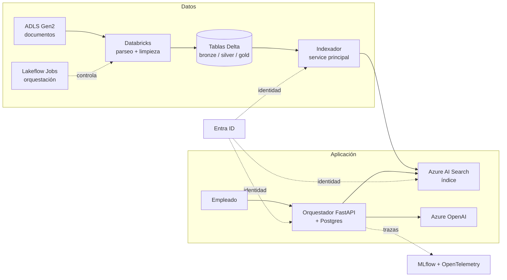

# Investigación R1 — Guía explicada: la plataforma de datos e IA en Azure y el oficio de ingeniería Python

> Fecha de consulta: 05-10-2026.
> Las fichas bibliográficas completas (autor, DOI, nivel de evidencia, acceso) están en `investigacion-r1-anexo-fichas.md`. Aquí cada fuente se cita por su código, por ejemplo **E1.1**, para que puedas buscarla en el anexo.

## Qué es este documento y cómo leerlo

Este documento responde a tres preguntas:

1. **Qué piezas forman tu plataforma** y qué problema resuelve cada una.
2. **Qué hay que leer** de cada pieza, en qué orden y por qué esa fuente y no otra.
3. **Qué ha cambiado entre 2025 y 2026** que te puede romper algo en producción o dejarte un dato obsoleto en clase.

Cada capítulo tiene la misma estructura: *qué es*, *por qué te importa*, *qué leer* y *trampas*. Al final hay un glosario con todas las siglas. Si una sigla no te suena, está ahí.

Los códigos **E1** a **E8** son los ocho ejes temáticos de la investigación. **E9** son las fuentes que hay que vigilar de forma continua. **R2** es la siguiente investigación, que cubrirá RAG, agentes, evaluación y regulación; cuando algo se remite a R2 es que aquí solo se apunta.

---

## 1. El mapa: cómo encajan las piezas

Tu sistema, visto de principio a fin, es este:

1. **Los documentos llegan** a un almacenamiento en Azure (ADLS Gen2, el servicio de ficheros de Azure para datos).
2. **Databricks los procesa**: los parsea, los limpia, los trocea y los guarda en tablas Delta. Esto es un ETL, un pipeline de datos.
3. **Lakeflow Jobs orquesta** esos pasos: decide cuándo se ejecuta cada tarea y en qué orden.
4. **Un indexador** lee la tabla final de preguntas y respuestas y la empuja a **Azure AI Search**, que es el buscador.
5. **Tu orquestador en FastAPI** recibe la pregunta de un empleado, consulta AI Search con la identidad de ese empleado, construye el contexto y llama a **Azure OpenAI** para redactar la respuesta.
6. **Entra ID** (el directorio de identidades de Microsoft) atraviesa todo: cada salto se autentica y los permisos de cada empleado deciden qué documentos puede ver.
7. **MLflow y OpenTelemetry** registran qué pasó en cada petición: qué se buscó, qué devolvió el buscador, cuántos tokens costó y cuánto tardó.
8. **Tus librerías Python** son el código compartido entre el indexador, el orquestador y las clases. Se publican en Nexus, tu repositorio interno de paquetes.

| Pieza | Eje | Problema que resuelve |
|---|---|---|
| Databricks, Delta Lake, Unity Catalog | E1 | Guardar y gobernar los datos a escala con garantías transaccionales. |
| Lakeflow Jobs, bundles | E2 | Ejecutar los pipelines de forma fiable, repetible y desplegable como código. |
| ETL, parseo de PDF, calidad de datos | E3 | Convertir documentos en filas limpias que el buscador pueda indexar. |
| Azure AI Search, Azure OpenAI, APIM | E4 | Buscar y redactar respuestas, con cuotas y residencia de datos controladas. |
| Entra ID, permisos a nivel de documento | E5 | Que cada empleado vea solo lo que puede ver. |
| Empaquetado Python, repos, Python 3.14 | E6 | Que las librerías internas sean reproducibles, seguras y mantenibles. |
| Resiliencia, SSDLC, deuda técnica | E7 | Que el sistema aguante fallos y pase auditorías. |
| MLflow, OpenTelemetry | E1.8, E1.12, E7.9, E7.13, E7.14 | Saber qué hizo el sistema en cada petición y cuánto costó. |
| Puentes (DDIA, Sagas, FinOps, equipos) | E8 | Ideas transversales que conectan los ejes anteriores. |

---

## 2. Databricks y Delta Lake (E1)

### Qué es

**Apache Spark** es un motor que reparte el procesamiento de datos entre muchas máquinas. Tú escribes código que parece operar sobre una tabla; Spark lo divide en tareas y las ejecuta en paralelo. Su unidad histórica es el **RDD** (E1.3), y su capa moderna es **Spark SQL** con el optimizador **Catalyst** (E1.4), que convierte tu consulta en un plan de ejecución. Cuando un job falla a mitad, el mensaje habla de *stages* y *tasks*; esos conceptos vienen de aquí.

**Delta Lake** (E1.1) es un formato de tabla. Por debajo son ficheros Parquet en el almacenamiento, más un **log de transacciones**: un directorio de ficheros JSON que registra cada cambio. Ese log es lo que da a Delta las propiedades de una base de datos: transacciones ACID (una escritura se ve entera o no se ve), *time travel* (leer la tabla como estaba hace una hora), `MERGE` (upsert) y *Change Data Feed* (CDF, una lista de qué filas cambiaron entre dos versiones). Sin el log, un lago de datos es solo un montón de ficheros.

**Lakehouse** (E1.2) es el nombre de la idea: usar un almacenamiento barato de objetos como si fuera un data warehouse, gracias a formatos como Delta. Es un *position paper* de Databricks, así que defiende su producto, pero explica bien los límites.

**Databricks** es la plataforma que junta Spark, Delta y un catálogo de gobierno llamado **Unity Catalog**. En Unity Catalog cada tabla tiene un nombre de tres partes (`catalogo.esquema.tabla`), permisos por usuario o grupo, y desde 2026 **ABAC** (E1.10): reglas basadas en atributos, por ejemplo "la columna etiquetada como PII se enmascara para quien no tenga el rol X". También existen los **row filters** y **column masks**, que ocultan filas o enmascaran columnas según quién consulte.

### Por qué te importa

Tu indexador lee tablas gold de Unity Catalog. Lo que vea el indexador es lo que acabará en el buscador. Si una fila no debe salir del banco, el sitio más seguro para pararla es un row filter en la tabla, antes de que llegue a AI Search. Y si retiras un modelo de embeddings y tienes que reindexar, el *time travel* y el CDF de Delta te permiten reprocesar solo lo que cambió.

### Qué leer y en qué orden

1. **E1.6 Learning Spark, 2.ª ed.** Es la entrada más corta a Spark 3 y Delta. Está pensado para gente que ya programa. Léelo antes que nada.
2. **E1.1 Delta Lake (paper VLDB 2020).** Doce páginas. Explica el log de transacciones y con eso entiendes `OPTIMIZE`, `VACUUM`, el time travel y por qué `MERGE` es caro.
3. **E1.2 Lakehouse (CIDR 2021).** Diez páginas. Da el porqué de la arquitectura entera.
4. **E1.10 Documentación de ABAC y row filters.** Es la pieza que decide qué ve tu indexador.
5. **E1.11 Lab 11 del curso DP-750T00.** Práctica guiada y gratuita con Lakeflow Jobs.
6. Para profundizar: **E1.5 Spark: The Definitive Guide** (joins, shuffles, particionado) y **E1.7 Delta Lake: The Definitive Guide**.

### Trampas

- **ABAC** está en GA (disponibilidad general) desde el 28-04-2026 según las notas de versión de Databricks, pero las políticas DENY y GRANT están en Beta. En banca, Beta significa sin SLA: no apoyes un control de cumplimiento en ellas.
- **Límite de 100 políticas por catálogo** y no funciona en versiones de Databricks Runtime anteriores a la 12.2 LTS ni sobre vistas.
- Los libros de Spark son de la era 2.x o 3.0; los conceptos valen, pero contrasta **Liquid Clustering** (el sustituto del particionado clásico en Delta) con la documentación actual.

---

## 3. Orquestación: Lakeflow Jobs y Declarative Automation Bundles (E2)

### Qué es

Un **orquestador** es el programa que decide cuándo se ejecuta cada tarea de un pipeline, en qué orden y qué pasa si una falla. Airflow es el orquestador clásico (E2.6); Dagster es una alternativa que organiza el trabajo por "activos" (tablas, ficheros) en lugar de por tareas (E2.7).

**Lakeflow Jobs** es el orquestador nativo de Databricks. Hasta 2025 se llamaba *Workflows*. Un job es una lista de tareas (notebooks, scripts, consultas SQL) con dependencias entre ellas, y se lanza por un **trigger** (E2.1). Los triggers que existen son:

| Trigger | Cuándo se dispara | Para qué te sirve |
|---|---|---|
| Scheduled | A una hora, con sintaxis cron. | Reindexados nocturnos. |
| Table update | Cuando una tabla de Unity Catalog cambia. | Reindexar AI Search cuando cambia la tabla gold de preguntas y respuestas. |
| File arrival | Cuando llega un fichero a una ruta. | Procesar documentos nuevos. |
| Continuous | Siempre en marcha. | Streaming. |
| Model update (Beta) | Cuando se registra un modelo nuevo. | Todavía no, está en Beta. |

**Declarative Automation Bundles** (E2.2, E2.3) es la forma de describir jobs, pipelines y permisos como código. Hasta el 16-03-2026 se llamaban *Databricks Asset Bundles*. Escribes un fichero `databricks.yml` con la definición de tus jobs y varios *targets* (dev, pre, pro); la CLI de Databricks lo valida y lo despliega. El campo `run_as` dice con qué identidad corre el job, lo que conecta con los permisos del capítulo 6.

### Por qué te importa

Tu indexador es exactamente el caso de uso del trigger *table update*: cuando la tabla gold cambia, se lanza el job que empuja los cambios a AI Search. Y los bundles son la forma de que ese job esté en Git, se revise en un pull request y se despliegue igual en dev y en producción.

Hay un concepto de fondo que hace todo esto seguro: la **idempotencia** (E2.5). Un pipeline es idempotente si ejecutarlo dos veces sobre los mismos datos da el mismo resultado que ejecutarlo una vez. Se consigue escribiendo particiones completas en lugar de añadir filas, de modo que un reintento sobrescribe en lugar de duplicar. Sin idempotencia, cada reintento es un riesgo.

### Qué leer

1. **E2.1 Documentación de triggers.** Corta y es la referencia.
2. **E2.3 Configuración de bundles.** Para montar el `databricks.yml` con targets y `run_as`.
3. **E2.5 Functional Data Engineering (Beauchemin).** Un ensayo de media hora que explica la idempotencia y las particiones inmutables. Es la lectura que más cambia cómo diseñas pipelines.
4. **E2.6 Data Pipelines with Apache Airflow.** Aunque no uses Airflow, enseña a pensar en DAGs (grafos de tareas) y en *backfills* (reprocesar el pasado).
5. **E2.2 Notas de versión de bundles.** Para saber qué versión mínima de la CLI fijar en el CI.

### Trampas

- El **renombrado** de 2026: si buscas "Asset Bundles" encontrarás documentación vieja. El motor nuevo (*direct*) ya no usa Terraform por debajo.
- Para desplegar catálogos desde un bundle hace falta la **CLI 0.287.0** o superior.
- Con **más de 100 triggers** de llegada de ficheros hay que activar *file events* en el almacenamiento (E2.10).
- **Sobrescribir un fichero existente no dispara** el trigger de llegada; solo lo hacen los ficheros nuevos (E2.10).
- El post de Databricks sobre "orquestación data-first" (E2.8) es marketing del proveedor; úsalo para conocer su argumento, no como evidencia.

---

## 4. Pipelines de datos y el ETL documental para RAG (E3)

### Qué es

**ETL** significa *extract, transform, load*: sacar datos de un origen, transformarlos y cargarlos en un destino. **ELT** es la variante moderna: cargar primero y transformar dentro del almacén. Para tu caso, el RAG documental es ETL puro: hay que parsear PDFs y limpiar texto *antes* de que entre nada en el índice.

La **arquitectura medallion** organiza las tablas en tres capas: **bronze** (datos crudos tal como llegan), **silver** (limpios y validados) y **gold** (listos para consumir, en tu caso la tabla de preguntas y respuestas). Hay dos escuelas sobre cómo modelar las capas superiores:

- **Kimball** (E3.2): modelado dimensional. Tablas de hechos (eventos) rodeadas de dimensiones (quién, qué, cuándo). Incluye las **SCD** (*slowly changing dimensions*), la técnica para guardar el historial de algo que cambia despacio, como la oficina a la que pertenece un empleado. Es el modelo de la capa gold.
- **Inmon** (E3.3) y **Data Vault** (E3.4): modelos normalizados pensados para auditar. Data Vault separa claves (hubs), relaciones (links) y atributos con fecha (satellites), de modo que nunca se pierde quién dijo qué y cuándo. Es lo habitual en banca para la capa silver.

La **calidad de datos** se controla con *expectations*: reglas que se evalúan sobre cada lote ("esta columna no puede ser nula", "este importe es positivo"). Las filas que fallan se mandan a cuarentena en lugar de parar el pipeline. **DQX** (E3.12) es la librería de Databricks Labs para esto; la base teórica es el paper de Google sobre validación de datos (E3.6).

El **parseo de documentos** es el paso donde más se pierde. Un PDF es una lista de posiciones de caracteres, no un texto; recuperar párrafos, tablas y títulos es un problema de visión por computador. Hay tres familias de herramientas:

| Herramienta | Qué es | Cuándo |
|---|---|---|
| **Docling** (E3.8) | Parser de IBM, local, sin modelos grandes. | Cuando los documentos no pueden salir de tu infraestructura. En calidad va por detrás de los VLM. |
| **MinerU** (E3.10) | Modelo de visión-lenguaje (VLM) abierto, pequeño (1,2B parámetros). | El estado del arte abierto; se puede desplegar en OpenShift. |
| **Azure Content Understanding** | Servicio de Microsoft, integrado en AI Search desde la API `2026-04-01` (E3.13). | Cuando te vale que el documento se procese en Azure. |

**OmniDocBench** (E3.9) es el benchmark con el que se comparan todos. Ojo: cambia de versión y las cifras solo son comparables dentro de una misma versión.

### Por qué te importa

El paper de las *data cascades* (E3.7) lo dice con datos: los proyectos de IA fallan por los datos, no por el modelo. Si el parser convierte una tabla de comisiones en una sopa de números, el buscador devolverá el fragmento equivocado y el modelo redactará una respuesta falsa con mucha seguridad. El paper E3.11 propone medir el parseo por su efecto en el retrieval, no por la fidelidad del texto. Ese es el criterio correcto para tu comparativa.

### Qué leer

1. **E3.1 Fundamentals of Data Engineering (Reis y Housley).** El mapa completo del ciclo de vida del dato. Es el libro general de este eje.
2. **E3.2 The Data Warehouse Toolkit (Kimball).** Al menos los capítulos de hechos, dimensiones y SCD. Es lo que modela tu capa gold.
3. **E3.6 Data Validation for ML.** Para diseñar las expectations.
4. **E3.7 Data Cascades.** Para convencer a quien haga falta de que el ETL documental merece presupuesto.
5. **E3.9 OmniDocBench** y **E3.10 MinerU**, para la comparativa de parsers.
6. **E3.13 Novedades de AI Search de abril de 2026**: push frente a pull, aliases y parseo integrado.

### Trampas

- **Push frente a pull**: AI Search puede ir a buscar los datos (pull, con un indexador propio del servicio) o puedes empujarlos tú desde Databricks (push). Para tu caso es push: controlas el parseo, la identidad y el momento.
- **Aliases** para reindexar en azul/verde: construyes un índice nuevo, lo pruebas, y cambias el alias. Los clientes nunca apuntan al índice directamente.
- Las cifras de MinerU y Docling en OmniDocBench las publican los propios equipos o sus competidores. Reprodúcelas con tus documentos.

---

## 5. Azure AI Search y Azure OpenAI (E4)

### Qué es

**Azure AI Search** es un buscador gestionado. Guardas documentos (en tu caso fragmentos de texto con sus vectores) en un índice y lo consultas. Soporta tres formas de buscar que se combinan en la **búsqueda híbrida** (E4.9):

- **Búsqueda por palabras clave** (BM25): encuentra coincidencias exactas de términos. Buena para códigos de producto, nombres y siglas.
- **Búsqueda vectorial**: convierte la pregunta en un vector con un modelo de embeddings y busca fragmentos cercanos. Buena para sinónimos y paráfrasis.
- **Fusión** de ambas listas con **RRF** (*reciprocal rank fusion*) y, opcionalmente, un **semantic ranker** que reordena los primeros resultados con un modelo de lenguaje.

La API del servicio está **versionada por fecha** (E4.1). Cada versión añade o quita cosas, y el SDK de Python (`azure-search-documents`) va emparejado con una versión concreta. Hoy la versión estable del plano de datos es `2026-04-01`.

**Agentic retrieval** es la función en la que el servicio, dada una conversación, planifica varias consultas, las ejecuta y devuelve los fragmentos. En las previews de 2025 también redactaba una respuesta; en la versión estable `2026-04-01` eso se ha quitado: solo recupera, y el parámetro `messages` pasó a llamarse `intents`. **Foundry IQ** (E4.2) es el envoltorio de alto nivel: una *knowledge base* que agrupa varias fuentes y se expone como herramienta MCP para agentes.

**Azure OpenAI** sirve los modelos de OpenAI dentro de Azure. Cada modelo se despliega como un *deployment* con un **tipo** (E4.5):

| Tipo | Dónde se procesa | Para banca |
|---|---|---|
| Global | En cualquier región del mundo. | No. |
| Data Zone (UE) | En cualquier Estado miembro de la UE. | Aceptable; los datos en reposo se quedan en la geografía. |
| Regional | En la región que eliges. | La opción más conservadora. |

A cada tipo se le suma un modo de capacidad: *Standard* (pago por uso), *Provisioned* (PTU, capacidad reservada) o *Batch*. **El tipo no se puede cambiar después** de crear el deployment.

Los modelos **se retiran** (E4.4): un modelo GA se retira a los 18 meses con 60 días de aviso. Si se retira tu modelo de embeddings, tienes que reindexar entero, porque los vectores de un modelo no son comparables con los de otro. Desde agosto de 2025 hay una **API v1** sin parámetro `api-version` que se usa con el cliente estándar `OpenAI()`; según Microsoft Learn, en su lanzamiento solo cubría un subconjunto de las capacidades.

**API Management (APIM)** con sus políticas de **AI Gateway** (E4.6) se pone delante de Azure OpenAI para poner cuotas de tokens por aplicación, emitir métricas, cachear respuestas semánticamente y desbordar de PTU a pago por uso cuando se agota la capacidad reservada.

### Por qué te importa

Tres decisiones de arquitectura dependen de este eje: qué versión de API fijas (y por tanto qué SDK), qué tipo de deployment eliges (y por tanto si cumples RGPD y DORA) y cómo te proteges del 429 (demasiadas peticiones) con APIM y los patrones del capítulo 9.

### Qué leer

1. **E4.1 Versiones de la API de AI Search y guía de migración.** Es la página que hay que leer con la fecha delante.
2. **E4.3 Arquitectura de referencia de chat con Foundry.** La arquitectura canónica de Microsoft: red privada, identidad, alta disponibilidad. Tu orquestador va en OpenShift, así que hay que adaptarla, pero las decisiones de red y de identidad valen.
3. **E4.4 Ciclo de vida de modelos y API v1.**
4. **E4.5 Tipos de deployment y Data Zones.**
5. **E4.6 Laboratorios de AI-Gateway.** Para las políticas de APIM.
6. **E4.7 azure-search-openai-demo.** Un RAG de referencia en Python, útil como minirepo para clase.

### Trampas

- `2026-04-01` **no filtra permisos** en blob ni en OneLake; eso sigue en preview (capítulo 6).
- Los porcentajes de mejora de Foundry IQ (+36 %, +54 %) son benchmarks del propio proveedor, sin evidencia independiente.
- El benchmark de búsqueda híbrida de Microsoft (E4.9) usa embeddings de 2023; la conclusión cualitativa sigue valiendo, las cifras no.
- La disponibilidad de las políticas `llm-*` de APIM por tier de servicio no está verificada.

---

## 6. Identidad y permisos (E5)

### Qué es

Primero los conceptos, porque aquí las siglas se amontonan:

- **Autenticación** es demostrar quién eres. **Autorización** es decidir qué puedes hacer.
- **Mínimo privilegio** y **mediación completa** (E5.1, 1975): cada componente tiene solo los permisos que necesita, y cada acceso se comprueba, sin excepciones ni cachés que se salten el control. Son los dos principios de los que sale todo lo demás.
- **RBAC** (E5.2): permisos por rol. "Los gestores de banca privada ven la carpeta X".
- **ABAC** (E5.3): permisos por atributos. "Quien tenga el atributo *oficina = Madrid* ve las filas con *oficina = Madrid*". Es lo que implementa Unity Catalog.
- **ReBAC**, el modelo de **Zanzibar** (E5.4): permisos por relaciones ("A es editor del documento D, D pertenece a la carpeta C, el grupo G puede leer C"). Es el sistema de Google para Drive y YouTube. Su concepto clave es el **problema del nuevo enemigo**: si a alguien le quitan el permiso a las 10:00 y el sistema todavía responde con datos de las 9:59, esa persona ve lo que ya no debería. En tu caso es exactamente la pregunta de cuánto tarda el índice en reflejar que un empleado ya no está en un grupo.
- **Zero Trust** (E5.5): no te fías de nada por estar dentro de la red. Cada salto (empleado → API → AI Search → almacenamiento) se autentica.

En Azure, la identidad es **Entra ID** (E5.6). Tres mecanismos te interesan:

- **Managed identity**: un servicio de Azure tiene identidad propia sin que haya una contraseña que guardar.
- **Workload identity federation**: lo mismo para cargas fuera de Azure, como tu orquestador en OpenShift. Un token del clúster se intercambia por un token de Entra. Resultado: sin secretos en OpenShift.
- **OBO** (*on-behalf-of*): tu API recibe el token del empleado y lo cambia por otro token para llamar a AI Search *como ese empleado*. Así el buscador sabe quién pregunta.

En AI Search hay roles de **plano de control** (gestionar índices) y de **plano de datos** (leer o escribir documentos). *Index Data Reader* consulta pero no puede tocar el índice. El indexador debe tener solo el rol de escritura sobre su índice, y el orquestador solo el de lectura.

### Permisos a nivel de documento

Esta es la parte crítica del eje. Hay dos maneras de que un empleado vea solo los documentos que puede ver:

**Security filters (lo defendible hoy).** Cada documento del índice lleva un campo con los grupos que pueden leerlo. Tu orquestador obtiene los grupos del empleado (del token o de Graph) y añade un filtro a cada consulta: `grupos/any(g: search.in(g, 'G1,G2,G3'))`. El filtrado lo hace el servidor, pero la lógica es tuya y está en tu código, auditable.

**ACL nativo (preview, E5.9).** AI Search guarda las ACL del documento y filtra sola. Tu orquestador manda el token del empleado en la cabecera `x-ms-query-source-authorization`. Historial:

| Versión | Qué trae | Problema |
|---|---|---|
| `2025-05-01-preview` | ACL de ADLS Gen2 y RBAC. | Si consultabas con clave de API y sin token de usuario, **devolvía todos los documentos**. |
| `2025-08-01-preview` | Más orígenes. | El mismo comportamiento. |
| `2025-11-01-preview` | SharePoint y Purview. | Corrige el agujero anterior. |
| `2026-05-01-preview` | Exige un permiso *elevated-read* para verlo todo. | Sigue en preview, sin SLA. |

Además, no admite *owning user/group* ni *Other* de las ACL POSIX, y basta con que coincida un solo campo de permisos para que el documento se devuelva.

### Por qué te importa

Es el riesgo regulado número uno de la investigación. Una preview sin SLA que en dos versiones devolvía todo a quien consultaba con clave no es un control que puedas presentar a auditoría. La recomendación es **security filters propios con OBO** y, cuando el ACL nativo llegue a GA, migrar con las dos cosas en paralelo durante un tiempo.

El caso de **Wiz** (E5.8) enseña la otra mitad: un token **SAS** (una URL firmada que da acceso a un almacenamiento) de cuenta completa, válido hasta 2051 y publicado en GitHub, expuso 38 TB de datos de Microsoft. La regla que sale de ahí: prohibir los Account SAS; si hace falta un SAS, que sea de *user delegation* (ligado a una identidad de Entra) y de corta duración (E4.10).

### Qué leer

1. **E5.1 Saltzer y Schroeder.** Las diez páginas de principios. Es de 1975 y sigue siendo lo mejor que hay.
2. **E5.5 NIST SP 800-207, Zero Trust.** Corto y es el marco que los auditores reconocen.
3. **E5.9 Document-level access control en AI Search.** Léelo con las versiones delante.
4. **E5.4 Zanzibar.** Para entender el problema del nuevo enemigo y diseñar la frescura de las ACL en el índice.
5. **E5.8 El informe de Wiz.** Media hora. Es el caso que cuentas en clase.
6. **E5.6 Entra ID** (OBO, managed identities, federación) y **E5.7 Unity Catalog** (service principals, `run_as`, external locations).

---

## 7. Python: librerías, empaquetado y repos (E6)

### Qué es

**Empaquetar** una librería es describirla (nombre, versión, dependencias) en `pyproject.toml` según el estándar **PEP 621** (E6.1), construirla y publicarla en un repositorio de paquetes. El tuyo es **Nexus**, que hace de espejo de PyPI y de registro interno.

Un **lock file** fija la versión exacta y el hash de cada dependencia, directa o transitiva, para que dos instalaciones den el mismo resultado. Hasta 2025 cada herramienta tenía su formato (`poetry.lock`, `uv.lock`, `Pipfile.lock`). **PEP 751** (E6.2) define un formato común, `pylock.toml`. Estado real:

| Herramienta | Soporte de `pylock.toml` |
|---|---|
| pip | `pip lock` experimental desde 25.1; instalación experimental desde 26.1 (según pydevtools). |
| uv | Lo exporta, pero sigue usando `uv.lock` como formato propio. |
| PDM | Lo soporta. |
| Poetry | No. |

El relato de por qué tardó cuatro años (E6.3) lo cuenta el autor del PEP y explica la pelea entre uv y Poetry.

**Alucinación de paquetes** (E7.5): cuando pides a un LLM que escriba código, inventa nombres de librerías que no existen. Un atacante registra ese nombre en PyPI con código malicioso. El estudio de USENIX Security 2025 probó 16 modelos con 576.000 muestras: al menos un 5,2 % de los paquetes que sugieren los modelos comerciales no existen, y un 21,7 % en los abiertos. La defensa es una **allowlist** en Nexus: solo se pueden instalar paquetes aprobados.

**Monorepo o polyrepo** (E6.9, E6.10, E6.11): Google guarda todo su código en un solo repositorio, pero necesita herramientas propias para que funcione. El estudio de Jaspan mide ventajas (visibilidad, refactorizaciones globales) y costes (tooling). **InnerSource** es la alternativa: varios repos con prácticas de código abierto hacia dentro de la empresa. Para ti: polyrepo, librerías versionadas y una plantilla (copier) para crear repos iguales.

**Python 3.14** (E6.5) trae cambios que afectan a tu stack:

- **Free-threading** (PEP 779): un build sin GIL que permite hilos en paralelo de verdad. No está activado por defecto; hay que instalar el build específico. En código de un solo hilo cuesta entre un 5 % y un 10 %, según la plataforma y el compilador.
- **Anotaciones diferidas** (PEP 649 y 749): las anotaciones de tipos ya no se evalúan al definir la función, sino cuando alguien las pide. Pydantic, FastAPI y SQLAlchemy las inspeccionan en tiempo de ejecución, así que hay que comprobar que las versiones que usas lo soportan.
- **Template strings** (PEP 750), **subintérpretes** (PEP 734) y otros.
- La sección **"Porting to Python 3.14"** de las notas de versión es la checklist de migración.

### Qué leer

1. **E6.5 What's new in Python 3.14.** La sección de porting, con tu código al lado.
2. **E6.2 PEP 751.** Para saber qué formato de lock mandar a Sonatype (la herramienta de análisis de dependencias).
3. **E6.6 Robust Python.** Tipos de dominio, `Protocol` frente a clases abstractas (ABC), y cómo hacer que el código se explique solo. Es anterior a PEP 695 (la sintaxis nueva de genéricos), pero los principios valen.
4. **E6.10 Jaspan** y **E6.11 InnerSource**, para la decisión de repos.
5. **E6.4 Documentación de uv** sobre workspaces y exportación a pylock y CycloneDX (formato de SBOM, inventario de componentes).
6. **E6.12 Changelogs del stack.** Cada versión de API de AI Search va con una versión del SDK; hay que fijarlas juntas. Solo está verificado `azure-search-documents` 11.6.0.

### Trampas

- `Protocol` frente a `ABC`: un `Protocol` define una interfaz por forma (si tiene estos métodos, vale); una `ABC` exige heredar. Para los puertos de una arquitectura hexagonal, `Protocol`.
- Las fechas de la 3.ª edición de Effective Python (E6.7) y del libro de Hillard (E6.8) no están verificadas.

---

## 8. Buenas prácticas de ingeniería y SSDLC (E7)

### Qué es

**Resiliencia** (E7.1, *Release It!*): patrones para que un servicio aguante cuando otro falla. Los cuatro que necesitas frente a Azure OpenAI y AI Search:

- **Timeout**: nunca esperes indefinidamente.
- **Circuit breaker**: si un servicio falla repetidamente, deja de llamarlo durante un tiempo y falla rápido, en lugar de acumular peticiones colgadas.
- **Bulkhead**: separa los recursos (pools de conexiones, workers) por dependencia, para que un fallo de OpenAI no agote los workers que atienden a AI Search.
- **Backoff con jitter** ante un **429** (el código HTTP de "demasiadas peticiones"): reintenta esperando cada vez más, con algo de azar para no sincronizar a todos los clientes.

**Errores en la API**: RFC 9457 (E7.10) define un JSON estándar de error (*problem details*) con tipo, título, estado y detalle. Sustituye a RFC 7807. FastAPI lo implementa en unas pocas líneas. **Twelve-Factor** da las reglas de configuración por variables de entorno, y **Diátaxis** una estructura de documentación en cuatro tipos (tutorial, guía, referencia, explicación).

**Deuda técnica en ML** (E7.2): el paper de Sculley explica por qué los sistemas de ML acumulan deuda distinta a la del software normal: *glue code* (código pegamento alrededor del modelo), dependencias de datos no declaradas y bucles de realimentación ocultos. Vale igual para un sistema con LLM. El **ML Test Score** (E7.3) lo convierte en una rúbrica con puntuación.

**SSDLC** (*secure software development lifecycle*, E7.8): el marco para que el desarrollo pase auditoría. Los estándares que se citan:

| Estándar | Qué es | Herramienta tuya que lo cubre |
|---|---|---|
| NIST SP 800-218 (SSDF) | Prácticas de desarrollo seguro. | Marco general. |
| OWASP ASVS 5.0 | Requisitos de seguridad de aplicaciones. | Fortify, SonarQube. |
| SLSA | Niveles de integridad de la cadena de suministro. | CI. |
| OpenSSF Scorecard | Puntuación de higiene de un repo. | CI. |
| CycloneDX / SPDX | Formatos de SBOM (inventario de componentes). | Sonatype, Sysdig. |

**DORA** (E7.6, E7.7): el equipo de investigación de Google Cloud que mide rendimiento de entrega con cuatro métricas (frecuencia de despliegue, tiempo de entrega, tasa de fallos, tiempo de recuperación). Su informe de 2025 sobre IA concluye que la IA amplifica lo que ya hay: los equipos buenos mejoran, los malos empeoran; más throughput y menos estabilidad. Tiene versión en castellano. Ojo: DORA el equipo de Google no es DORA el reglamento europeo de resiliencia digital que te afecta por banca; coinciden en siglas.

### Qué leer

1. **E7.1 Release It!** Los capítulos de patrones de estabilidad.
2. **E7.5 Spracklen, alucinación de paquetes.** Es el argumento de la allowlist.
3. **E7.2 Sculley.** Nueve páginas.
4. **E7.8 SSDF y ASVS**, los dos que te pedirán en auditoría.
5. **E7.6 DORA 2025**, en castellano, para clase.
6. **E7.11 Feathers**, para los tests de caracterización que necesitas antes de migrar a 3.14: tests que capturan lo que el código hace hoy, sin juzgar si es correcto, para detectar cualquier cambio.
7. **E7.12 Python Testing with pytest** y **Observability Engineering** (este último enlaza con el capítulo 10).

---

## 9. MLflow

### Qué es

**MLflow** es una plataforma de código abierto para gestionar el ciclo de vida de modelos de machine learning. La creó Databricks en 2018 (E1.9) y en Databricks viene gestionada, sin instalar nada. Tiene cuatro piezas clásicas y dos nuevas para IA generativa:

| Pieza | Qué hace | Para qué te sirve |
|---|---|---|
| **Tracking** | Registra *experimentos* y *runs*: cada ejecución guarda parámetros, métricas y ficheros. | Comparar dos configuraciones de chunking o dos modelos de embeddings con las mismas preguntas de prueba. |
| **Models** | Un formato estándar para empaquetar un modelo con sus dependencias. | Menos relevante para ti: no entrenas modelos. |
| **Model Registry** | Versiones de modelos con alias (champion, challenger) y en Databricks integrado con Unity Catalog. | Versionar prompts y configuraciones de retrieval como si fueran modelos. |
| **Projects** | Describir cómo se ejecuta un experimento. | Poco uso hoy. |
| **Tracing** (nuevo, E1.12) | Captura cada paso de una petición a un sistema con LLM: la consulta a AI Search, la llamada a OpenAI, cada herramienta. Cada paso es un *span* con entradas, salidas, latencia y tokens. | Ver exactamente qué fragmentos devolvió el buscador y qué prompt llegó al modelo en una petición que salió mal. |
| **Evaluation** (`mlflow.genai.evaluate()`, E1.8) | Ejecuta un conjunto de preguntas de prueba contra tu sistema y aplica *scorers*: funciones, o jueces basados en LLM, que puntúan corrección, fundamentación en el contexto, seguridad, etc. | Saber si un cambio mejora o empeora antes de desplegarlo. |

En MLflow 3 (2025), la antigua *Agent Evaluation* de Databricks se fusionó dentro de `mlflow.genai`. Hay que instalar `mlflow[databricks]>=3.1`. Desde la 3.2.0 la versión de código abierto envía telemetría de uso a los mantenedores; en Databricks viene desactivada, pero si lo instalas fuera, desactívala por política.

### Cómo se usa en tu sistema

1. **En desarrollo**: activas `mlflow.openai.autolog()` (o el equivalente de la librería que uses) y cada llamada queda trazada sin tocar el código.
2. **En evaluación**: montas un conjunto de 50 a 200 preguntas con su respuesta esperada y la fuente correcta. Cada vez que cambies el chunking, el parser, el modelo de embeddings o el prompt, ejecutas `mlflow.genai.evaluate()` y comparas los runs. Los scorers de fundamentación (*groundedness*) detectan respuestas que no salen del contexto recuperado.
3. **En producción**: las trazas de MLflow se guardan en una tabla Delta y puedes muestrearlas para revisión humana o volver a pasar los scorers sobre tráfico real.

La evaluación en profundidad (qué scorers, qué conjunto de prueba, cómo medir el retrieval) va en R2. Aquí lo que importa es que MLflow es el sitio donde van a vivir esos datos.

### Qué leer

1. **E1.8 Documentación de MLflow 3 para GenAI.** Empieza por tracing y sigue por evaluation.
2. **E1.12 MLflow Tracing.** La página de conceptos: traza, span, autolog, exportación.
3. **E1.9 El paper de MLflow (2018).** Cuatro páginas; explica el diseño de runs y modelos que sigue vigente.

### Trampas

- La API de `mlflow.genai` ha cambiado entre la 3.0 y la 3.2. Fija la versión.
- Los scorers basados en LLM cuestan tokens y pasan datos al modelo juez: si el juez es Azure OpenAI, aplica la misma decisión de residencia de datos del capítulo 5.

---

## 10. OpenTelemetry

### Qué es

**OpenTelemetry** (OTel) es el estándar abierto, de la CNCF, para generar y transportar datos de observabilidad. Nació en 2019 de la fusión de OpenTracing y OpenCensus, y hoy es el único estándar que todos los proveedores (Azure Monitor, Datadog, Grafana, Dynatrace) aceptan. Su promesa es que instrumentas el código una vez y puedes cambiar de backend sin tocarlo.

Maneja tres **señales**:

| Señal | Qué es | Ejemplo en tu sistema |
|---|---|---|
| **Trazas** | El recorrido de una petición por varios servicios. Una traza es un árbol de **spans**; cada span es una operación con inicio, fin, atributos y, si falla, el error. | La petición del empleado → el span de FastAPI → el span de la consulta a AI Search → el span de la llamada a OpenAI. |
| **Métricas** | Valores agregados en el tiempo: contadores, histogramas. | Peticiones por minuto, latencia p95, tokens consumidos por aplicación. |
| **Logs** | Líneas de registro, correlacionadas con la traza. | El log de "429 recibido, reintentando" enlazado al span que lo sufrió. |

Las piezas:

- **API y SDK** en cada lenguaje. En Python, `opentelemetry-api` y `opentelemetry-sdk`, más *instrumentaciones* automáticas para FastAPI, httpx, requests y SQLAlchemy que crean spans sin que escribas nada.
- **Propagación de contexto**: el identificador de la traza viaja en una cabecera HTTP (`traceparent`) para que el span de AI Search se enganche al de tu API. El concepto viene del paper **Dapper** de Google (E7.13), que inventó este modelo en 2010.
- **OTLP**: el protocolo con el que se envían los datos.
- **Collector**: un proceso intermedio que recibe los datos, los filtra o enriquece y los reenvía al backend. Permite, por ejemplo, borrar atributos con datos personales antes de que salgan del clúster.
- **Semantic conventions**: el diccionario de nombres de atributos para que todo el mundo llame igual a lo mismo (`http.request.method`, `db.system`). Es lo que permite que un dashboard valga para cualquier servicio.

### Las convenciones para IA generativa (E7.9)

El grupo de trabajo GenAI de OTel define atributos `gen_ai.*` para las llamadas a modelos: proveedor, modelo pedido y modelo servido, tokens de entrada y de salida, temperatura, nombre de la operación, herramientas invocadas. También cubren MCP. El estado es **Development**: los nombres han cambiado entre versiones y pueden volver a cambiar. Desde la versión 1.42.0 (12-06-2026) tienen repositorio propio.

Consecuencia práctica: instrumenta ya, porque los datos los vas a querer, pero **no montes dashboards ni alertas sobre nombres de atributos `gen_ai.*` que no puedas renombrar en un sitio solo**. Centraliza el mapeo en tu librería interna.

### Cómo se usa en tu sistema

1. **Instrumentación automática** de FastAPI, httpx y SQLAlchemy en el orquestador. Con eso ya ves la latencia de cada dependencia.
2. **Exportación a Azure Monitor** con el paquete `azure-monitor-opentelemetry` (E7.14), que configura el SDK para mandar a Application Insights. Si prefieres neutralidad, un Collector en OpenShift y desde ahí a donde quieras.
3. **Spans manuales** para los pasos del RAG que no son llamadas HTTP: el reranking, la construcción del prompt, el filtro de seguridad.
4. **Métricas de negocio**: tokens por aplicación y por empleado, coste estimado, tasa de 429. APIM ya emite algunas con `llm-emit-token-metric` (E4.6); OTel te da las de tu propio código.

### Qué leer

1. **E7.14 Conceptos de OpenTelemetry** y la página de Azure Monitor. Una tarde.
2. **E7.9 Semantic conventions de GenAI.** Para saber qué atributos existen y en qué estado están.
3. **E7.12 Observability Engineering.** El libro de fondo: por qué las trazas con muchos atributos valen más que los logs, y cómo definir SLOs (objetivos de nivel de servicio).
4. **E7.13 Dapper.** Opcional, pero son catorce páginas y explica el modelo entero.

---

## 11. MLflow y OpenTelemetry juntos

Se solapan en las trazas y conviene tener clara la división:

| | MLflow Tracing | OpenTelemetry |
|---|---|---|
| **Para quién** | El equipo que mejora la calidad del RAG. | El equipo que opera el servicio. |
| **Qué captura** | Entradas y salidas completas de cada paso (prompts, fragmentos recuperados, respuestas). | Latencias, errores, dependencias, métricas. Las cargas útiles se evitan por tamaño y privacidad. |
| **Dónde se guarda** | En Databricks, en tablas Delta, junto a las evaluaciones. | En Azure Monitor o en el backend que elijas. |
| **Retención** | La que decidas en Unity Catalog. | La de Azure Monitor. |

La buena noticia es que **MLflow Tracing está construido sobre OpenTelemetry**: sus spans son spans de OTel y se pueden exportar también a un collector OTLP. En la práctica:

- Un solo identificador de traza para las dos vistas. Cuando un empleado reporta una respuesta mala, buscas la traza en Azure Monitor por hora y usuario, y con el mismo identificador abres en MLflow el prompt exacto y los fragmentos.
- Los **datos personales** van a MLflow, que está dentro de tu perímetro de datos en Databricks, y no a Azure Monitor. El collector o la configuración del exportador los filtra.
- Tu librería interna de observabilidad es el único sitio donde se nombran los atributos `gen_ai.*`, por la inestabilidad del capítulo 10.

---

## 12. Lo que ha cambiado entre 2025 y 2026

| Cambio | Qué significa para ti |
|---|---|
| Databricks Asset Bundles → **Declarative Automation Bundles** (16-03-2026). | Documentación y comandos con nombre nuevo; motor sin Terraform; CLI mínima a fijar en CI. |
| Workflows → **Lakeflow Jobs**; DLT → **Lakeflow Spark Declarative Pipelines**; Genie Spaces → Genie Agents. | Búsquedas en documentación vieja devuelven nombres que ya no existen. |
| AI Search **`2026-04-01`** estable: agentic retrieval sin síntesis ni query planning; `messages` → `intents`. | Si probaste con las previews de 2025, el código cambia. El modelo ya no redacta dentro del servicio; lo haces tú. |
| ACL nativo de AI Search: previews de 2025-05 y 2025-08 **devolvían todo** con clave y sin token. | No apoyes un control de acceso en ello. Security filters propios con OBO. |
| Azure AI Foundry → **Microsoft Foundry**; Azure OpenAI con **API v1** sin `api-version` (ago. 2025). | Cliente `OpenAI()` estándar; comprueba qué capacidades cubre. |
| **ABAC en Unity Catalog en GA** (28-04-2026); políticas DENY y GRANT en Beta. | Puedes usar ABAC; no uses DENY para cumplimiento todavía. |
| **Python 3.14**: free-threading opcional, anotaciones diferidas. | Revisar pydantic, FastAPI y SQLAlchemy antes de migrar. |
| **PEP 751** (`pylock.toml`) aceptado; uv solo exporta; Poetry no lo soporta. | Decide herramienta por compatibilidad con Nexus y Sonatype, no por velocidad. |
| Agent Evaluation → **`mlflow.genai`** (MLflow 3). | API nueva; fija versión. |
| OTel **`gen_ai.*` sigue en Development**. | No es cierto que sea estable. Nada de dashboards fijos sobre esos nombres. |
| RFC 7807 → **RFC 9457**. | Mismo formato de error, referencia nueva. |

---

## 13. Debates abiertos y tu posición

| Debate | Una postura | La otra | Lo que encaja contigo |
|---|---|---|---|
| Monorepo o polyrepo | Google: un repo, visibilidad total (E6.9, E6.10). | InnerSource: muchos repos con prácticas abiertas (E6.11). | Polyrepo con librerías versionadas y plantilla copier. El monorepo exige tooling que no tienes. |
| Kimball, Inmon o Data Vault | Dimensional, rápido de consultar. | Normalizado, auditable. | Data Vault en silver, Kimball en gold. |
| ETL o ELT | Cargar y transformar dentro. | Transformar antes de cargar. | El RAG documental es ETL: el parseo va antes. |
| Airflow o Dagster frente al nativo | Databricks defiende lo nativo (E2.8). | Neutralidad frente al proveedor. | Lakeflow Jobs mientras todo esté en Databricks. |
| uv, Poetry o pipenv | Velocidad. | Madurez. | Lo que funcione con Nexus y Sonatype. |
| ABC o Protocol | Jerarquías en tiempo de ejecución. | Interfaces estructurales. | Protocol para los puertos. |
| Hexagonal o pragmática | Percival y Gregory: puertos y adaptadores. | Ousterhout: módulos profundos, menos capas. | Hexagonal en el orquestador, donde cambiarás de buscador o de modelo. |
| LangChain o SDK directo | Integración rápida. | Menos dependencias y menos CVE. | Se decide en R2. |

---

## 14. Plan de lectura explicado

El orden está pensado para que cada lectura dé contexto a la siguiente. Cada bloque son una o dos semanas de lectura a ritmo de trabajo.

**Bloque 1 — Principios (E5.1 → E5.5 → E3.1 → E3.2).** Primero los principios de seguridad de Saltzer-Schroeder y Zero Trust, porque son el criterio con el que vas a juzgar todo lo demás. Después el mapa del dato de Reis y Housley y el modelado de Kimball, que te dan el vocabulario de los capítulos 2 a 4.

**Bloque 2 — Databricks (E1.6 → E1.1 → E1.2 → E1.10).** Spark en práctica, luego el paper de Delta para entender qué hay debajo, luego el porqué del lakehouse, y por último los permisos de Unity Catalog.

**Bloque 3 — Orquestación y calidad (E2.5 → E2.1 → E2.3 → E3.6 → E3.9).** La idempotencia primero, porque condiciona cómo diseñas los jobs; después los triggers y los bundles; después la validación de datos y el benchmark de parsers.

**Bloque 4 — AI Search y permisos (E4.1 → E5.9 → E5.4).** Las versiones de la API, el control de acceso a nivel de documento y Zanzibar para pensar la frescura de las ACL.

**Bloque 5 — Azure OpenAI (E4.5 → E4.4).** Residencia de datos y ciclo de vida de modelos.

**Bloque 6 — Python y resiliencia (E7.1 → E6.2 → E6.5).** Patrones de estabilidad, lock files, Python 3.14.

**Bloque 7 — Observabilidad (E7.14 → E1.8 → E7.9 → E7.12).** OpenTelemetry, MLflow para GenAI, las convenciones de GenAI y el libro de observabilidad.

**Bloque 8 — Deuda y organización (E7.2 → E7.5 → E6.10 → E8.5).** Deuda técnica en ML, alucinación de paquetes, monorepos y Team Topologies.

Y las entradas que valen como puente entre todo (E8): *Designing Data-Intensive Applications* en su 2.ª edición (E8.1, ya en tu plan), *Sagas* (E8.2) para las compensaciones cuando un reindexado falla a medias, *Cloud FinOps* (E8.6) para DBU, PTU y SKUs de AI Search, y *Team Topologies* (E8.5) para pensar la plataforma como producto.

---

## 15. Cruce con tu trabajo

| Lo que estás haciendo | Léete | Porque |
|---|---|---|
| Indexador de preguntas y respuestas | E2.1, E2.3, E3.13 | Trigger por cambio de tabla, service principal, push al índice y alias para azul/verde. |
| Permisos en AI Search | E5.9, E5.6, E5.4, E5.8 | Security filters con OBO; frescura de las ACL; prohibir Account SAS. |
| Orquestador FastAPI + Postgres | E7.1, E7.10, E4.4, E4.6 | Circuit breakers, errores RFC 9457, API v1, cuotas en APIM. |
| Observabilidad del orquestador | E7.14, E1.12, E7.9 | OTel en FastAPI, trazas de MLflow, atributos GenAI. |
| Librerías internas | E6.2, E6.6, E7.5 | Lock con hashes, Protocol, allowlist en Nexus. |
| Migración a Python 3.14 | E6.5, E7.11 | Checklist de porting y tests de caracterización. |
| RGPD y DORA (reglamento) | E4.5, E4.3 | Data Zone UE o Regional; arquitectura de referencia. |
| Clases | E6.5, E7.5, E4.7, E7.6 | Material actual, con un informe en castellano y un repo de ejemplo. |

---

## 16. Fuentes que vigilar (E9)

| Qué | Cada cuánto | Por qué |
|---|---|---|
| What's new in Azure AI Search (E9.1) | Mensual | Versiones de API y previews. |
| Release notes de Databricks (E9.2) | Mensual | Renombrados, GA de funciones, versiones de CLI. |
| Retiradas de modelos de Azure OpenAI | Continua | Un embeddings retirado obliga a reindexar. |
| Repositorio MicrosoftDocs/azure-ai-docs (E9.4) | Diaria si automatizas el diff | Los cambios de documentación llegan antes que los anuncios. |
| Azure/azure-rest-api-specs (E9.5) | Por versión | El PR #40678 añadió `/knowledgebases`, `/knowledgesources` y `/aliases`. |
| peps.python.org (E9.6), dora.dev (E9.7) | Trimestral | Estándares y evidencia. |
| ACM Queue, IEEE Software, InfoQ (E9.8) | Mensual | Divulgación técnica con revisión. |

---

## 17. Lo que no está verificado

- **Identificadores**: faltan la mayoría de ISBN y DOI. Están verificados Delta Lake, Jaspan, Zanzibar, Lakehouse, Sculley, Docling y Spracklen. La cifra del "19,7 %" de alucinación que circula no aparece en el abstract de Spracklen.
- **Ediciones**: Effective Python 3.ª ed., Delta Lake: The Definitive Guide, el libro de Hillard, DMBOK 2024 y ASVS 5.0.
- **Producto**: la preview `2026-08-01-preview` de AI Search, la disponibilidad de políticas `llm-*` por tier de APIM, pylock en pip 26.1, y la versión concreta de MLflow Tracing y del paquete de Azure Monitor para OTel.
- **Repos**: mlops-stacks, dqx, azure-search-openai-demo, AI-Gateway, GPT-RAG.
- **Cifras de proveedor**: los porcentajes de Foundry IQ y las puntuaciones de MinerU en OmniDocBench.
- **Fuera de alcance, va en R2**: RAG en profundidad, agentes, evaluación, guardarraíles y regulación.
- **Pendiente**: charlas del Data + AI Summit, PyConES, Dialnet; ampliar el eje E8 a diez entradas.

---

## Glosario

| Sigla o término | Qué es |
|---|---|
| **ABAC** | Attribute-Based Access Control. Permisos por atributos del usuario o del dato. |
| **ABC** | Abstract Base Class. Clase abstracta de Python; obliga a heredar. |
| **ACID** | Atomicidad, consistencia, aislamiento, durabilidad. Las garantías de una transacción. |
| **ACL** | Access Control List. Lista de quién puede hacer qué sobre un recurso. |
| **ADLS Gen2** | Azure Data Lake Storage. El almacenamiento de ficheros de Azure para datos. |
| **AI Search** | Azure AI Search. El buscador gestionado de Azure, con texto y vectores. |
| **APIM** | Azure API Management. Pasarela de APIs; con políticas de AI Gateway controla el uso de modelos. |
| **AQE** | Adaptive Query Execution. Spark reoptimiza el plan mientras ejecuta. |
| **ASVS** | OWASP Application Security Verification Standard. Requisitos de seguridad verificables. |
| **Backfill** | Reprocesar datos del pasado con un pipeline. |
| **BM25** | Algoritmo clásico de búsqueda por palabras clave. |
| **Bulkhead** | Compartimento estanco: aislar recursos para que un fallo no se propague. |
| **CDF** | Change Data Feed. Delta registra qué filas cambiaron entre versiones. |
| **Circuit breaker** | Dejar de llamar a un servicio que falla, durante un tiempo. |
| **CNCF** | Cloud Native Computing Foundation. Fundación que aloja Kubernetes y OpenTelemetry. |
| **Collector** | Proceso de OpenTelemetry que recibe, procesa y reenvía telemetría. |
| **CycloneDX / SPDX** | Formatos de SBOM. |
| **DAG** | Grafo dirigido acíclico. Cómo un orquestador representa tareas y dependencias. |
| **Data Vault** | Modelo de datos normalizado y auditable (hubs, links, satellites). |
| **DBU** | Databricks Unit. Unidad de facturación de Databricks. |
| **DORA (equipo)** | DevOps Research and Assessment, de Google Cloud. Métricas de entrega de software. |
| **DORA (reglamento)** | Digital Operational Resilience Act. Reglamento europeo de resiliencia digital para finanzas. |
| **Embedding** | Vector numérico que representa el significado de un texto. |
| **Entra ID** | El directorio de identidades de Microsoft, antes Azure AD. |
| **ETL / ELT** | Extraer, transformar y cargar, en uno u otro orden. |
| **Expectation** | Regla de calidad que se evalúa sobre los datos de un pipeline. |
| **Free-threading** | Build de Python sin GIL, con hilos en paralelo real. |
| **GA** | General Availability. Disponibilidad general, con SLA. Lo contrario de preview o Beta. |
| **GIL** | Global Interpreter Lock. El cerrojo que impide que dos hilos de Python ejecuten bytecode a la vez. |
| **Groundedness** | Que la respuesta del modelo esté sustentada en el contexto recuperado. |
| **Hexagonal** | Arquitectura de puertos y adaptadores: el dominio no depende de la infraestructura. |
| **Híbrida (búsqueda)** | Combinar palabras clave y vectores. |
| **Idempotencia** | Ejecutar dos veces da lo mismo que una. |
| **Lakehouse** | Data warehouse sobre almacenamiento de objetos, gracias a formatos como Delta. |
| **Lock file** | Fichero que fija la versión y el hash exacto de cada dependencia. |
| **Managed identity** | Identidad de un servicio de Azure sin contraseña que guardar. |
| **MCP** | Model Context Protocol. Protocolo para exponer herramientas a modelos y agentes. |
| **Medallion** | Capas bronze, silver y gold. |
| **MERGE** | Operación de upsert en Delta: inserta o actualiza según la clave. |
| **Nexus** | Repositorio interno de paquetes (Sonatype Nexus). |
| **OBO** | On-Behalf-Of. Tu API cambia el token del usuario por otro para llamar a un servicio como ese usuario. |
| **OTel** | OpenTelemetry. |
| **OTLP** | OpenTelemetry Protocol. El protocolo de envío de telemetría. |
| **PEP** | Python Enhancement Proposal. Documento de diseño o estándar de Python. |
| **PII** | Información personal identificable. |
| **Protocol** | En Python, interfaz estructural: cumple quien tenga los métodos, sin heredar. |
| **PTU** | Provisioned Throughput Unit. Capacidad reservada en Azure OpenAI. |
| **RAG** | Retrieval-Augmented Generation. Buscar primero, redactar con lo encontrado después. |
| **RBAC** | Role-Based Access Control. Permisos por rol. |
| **ReBAC** | Relationship-Based Access Control. Permisos por relaciones; el modelo de Zanzibar. |
| **RDD** | Resilient Distributed Dataset. La abstracción original de Spark. |
| **RRF** | Reciprocal Rank Fusion. Forma de fusionar dos rankings. |
| **run_as** | Identidad con la que se ejecuta un job de Databricks. |
| **SAS** | Shared Access Signature. URL firmada que da acceso a un almacenamiento de Azure. |
| **SBOM** | Software Bill of Materials. Inventario de componentes de un software. |
| **SCD** | Slowly Changing Dimension. Técnica para guardar el historial de una dimensión. |
| **Scorer** | Función o juez LLM que puntúa una respuesta en MLflow. |
| **Semantic conventions** | Diccionario de nombres de atributos de OpenTelemetry. |
| **Service principal** | Identidad de una aplicación en Entra ID. |
| **SLA** | Acuerdo de nivel de servicio. Las previews no tienen. |
| **SLO** | Objetivo de nivel de servicio, por ejemplo "p95 de latencia bajo 2 s". |
| **SLSA** | Supply-chain Levels for Software Artifacts. Niveles de integridad de la cadena de suministro. |
| **Span** | Una operación dentro de una traza, con inicio, fin y atributos. |
| **SSDF** | Secure Software Development Framework (NIST SP 800-218). |
| **SSDLC** | Ciclo de vida de desarrollo seguro. |
| **Time travel** | Leer una tabla Delta como estaba en una versión anterior. |
| **Traza** | El árbol de spans de una petición completa. |
| **Trigger** | Lo que dispara un job: hora, cambio de tabla, llegada de fichero. |
| **Unity Catalog** | El catálogo de gobierno de Databricks. |
| **VACUUM / OPTIMIZE** | Mantenimiento de Delta: borrar ficheros viejos y compactar. |
| **VLM** | Vision-Language Model. Modelo que entiende imágenes y texto; se usa para parsear PDFs. |
| **Workload identity federation** | Que una carga fuera de Azure (OpenShift) obtenga tokens de Entra sin secretos. |
| **WORM** | Write Once Read Many. Almacenamiento inmutable. |
| **Zero Trust** | No fiarse de nada por estar dentro de la red; autenticar cada salto. |
| **429** | Código HTTP de "demasiadas peticiones". |
