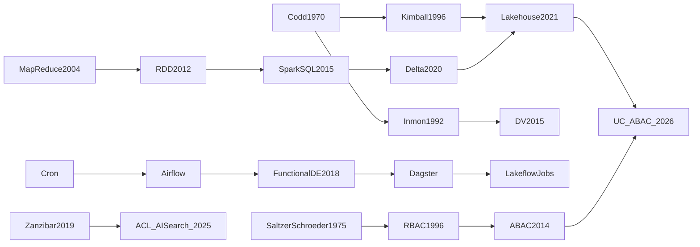

# Investigación R1 — La plataforma de datos e IA en Azure y el oficio de ingeniería Python como ecosistema

> Fecha de consulta: 05-10-2026

## Índice

1. [Cómo está organizado el material](#cómo-está-organizado-el-material)
2. [TL;DR](#tldr)
3. [Leyenda](#leyenda)
4. [Ejes de estudio (E1–E9)](#ejes-de-estudio)
   - [E1. Databricks como plataforma](#e1-databricks-como-plataforma)
   - [E2. Lakeflow Jobs y orquestación](#e2-lakeflow-jobs-y-orquestación)
   - [E3. ETL/ELT y pipelines, incluido el documental para RAG](#e3-etlelt-y-pipelines-incluido-el-documental-para-rag)
   - [E4. Azure para IA como plataforma](#e4-azure-para-ia-como-plataforma)
   - [E5. Identidad y permisos](#e5-identidad-y-permisos)
   - [E6. Librerías Python, empaquetado y repos](#e6-librerías-python-empaquetado-y-repos-minirepos)
   - [E7. Buenas prácticas de ingeniería y SSDLC](#e7-buenas-prácticas-de-ingeniería-y-ssdlc)
   - [E8. Puentes transversales](#e8-puentes-transversales)
   - [E9. Fuentes meta](#e9-fuentes-meta)
5. [Síntesis](#síntesis)
   - [Tronco](#1-tronco)
   - [Canon mínimo por eje](#2-canon-mínimo-por-eje)
   - [Estado del arte 2023–2026](#3-estado-del-arte-20232026)
   - [Debates abiertos](#4-debates-abiertos)
   - [Genealogía y tabla cruzada](#5-genealogía-y-tabla-cruzada)
   - [Lecturas de entrada por eje](#6-lecturas-de-entrada-por-eje)
   - [Cruce con tu perfil](#7-cruce-con-tu-perfil)
   - [Ruta de lectura](#8-ruta-de-lectura)
   - [Ediciones en castellano](#9-ediciones-en-castellano)
   - [Charlas, vídeo y audio](#10-charlas-vídeo-y-audio-verificados)
   - [Sitios de referencia continua](#11-sitios-de-referencia-continua)
   - [No verificados y dudas](#12-no-verificados-y-dudas)

---

## Cómo está organizado el material

El material de estudio se organiza en tres capas:

| Capa | Qué contiene | Cómo leerla |
|---|---|---|
| **Tronco académico estable** | Delta Lake, Lakehouse, Zanzibar, Kimball, Reis y Housley, Nygard, NIST SP 800-207 y PEP 751. | Vale durante años. |
| **Documentación oficial** | Databricks, Azure AI Search, Azure OpenAI, Python. | Entre 2025 y 2026 se renombró y rompió compatibilidad: leerla siempre con fecha y versión de API. |
| **Previews que afectan a banca** | La más crítica es el filtrado por ACL/RBAC en Azure AI Search. | Cambió de comportamiento entre previews y todavía no es estable. |

---

## TL;DR

### Qué estudiar primero

| Ámbito | Fuentes |
|---|---|
| Plataforma | Delta Lake (VLDB 2020) y Lakehouse (CIDR 2021). |
| Datos | Reis y Housley, y Kimball. |
| Operación | Documentación versionada de AI Search (estable `2026-04-01`), de Lakeflow Jobs y de Declarative Automation Bundles. |
| Seguridad | Saltzer-Schroeder, NIST SP 800-207 y Zanzibar. |
| Python | PEP 621 y 751, *Robust Python* y *Release It!*. |

### Cambios que te afectan

- **Databricks Asset Bundles** pasó a llamarse Declarative Automation Bundles el 16-03-2026.
- **AI Search `2026-04-01`** es la primera versión estable de agentic retrieval. Elimina la síntesis y el query planning, y sustituye `messages` por `intents`.
- **Azure OpenAI** ofrece desde agosto de 2025 una API v1 opcional sin `api-version`, según Microsoft Learn. Solo cubre un subconjunto de las capacidades de inferencia y autoría.
- **Python 3.14** soporta free-threading, pero no lo activa por defecto.
- **`pylock.toml`** es estándar, aunque uv solo lo usa para exportar.

### Riesgo regulado

- El ACL nativo de AI Search está en preview y sin SLA.
- Las previews de 2025-05 y 2025-08 devolvían todos los documentos si se consultaba con clave y sin token de usuario.
- Hoy lo defendible son security filters propios con OBO.
- En Azure OpenAI, elegir despliegue Global, Data Zone o Regional es una decisión de residencia de datos (RGPD, DORA).

---

## Leyenda

Cada entrada de los ejes E1–E8 sigue el mismo esquema:

```
#### Exx.y — Título
Autor · Año · Fuente · Tipo
NIVEL · EVIDENCIA · ACCESO · Castellano · DOI/URL/ISBN
- Vigencia
- Aporta
- Conecta con
```

| Campo | Valores |
|---|---|
| **Nivel** | fundacional · canónico · extensión · aplicado · referencia |
| **Evidencia** | contrastada · moderada · preliminar · sin evidencia |
| **Acceso** | abierto · compra · institucional |
| **[PROV]** | Material del proveedor. |
| **[YA EN PLAN]** | Ya está en tu plan de lectura. |
| **No verificado** | No se ha comprobado en la fuente primaria. |

---

## Ejes de estudio

### E1. Databricks como plataforma

#### E1.1 — Delta Lake: High-Performance ACID Table Storage over Cloud Object Stores

Michael Armbrust, Tathagata Das et al. (Databricks) · 2020 · PVLDB 13(12), pp. 3411–3424 · paper
**Fundacional** · evidencia contrastada · acceso abierto · castellano: no existe · DOI 10.14778/3415478.3415560

- **Vigencia:** el log sigue vigente; Liquid Clustering es posterior.
- **Aporta:** cómo un log de commits sobre object storage da ACID, time travel y MERGE.
- **Conecta con:** E1.2, E3.

#### E1.2 — Lakehouse: A New Generation of Open Platforms that Unify Data Warehousing and Advanced Analytics

Michael Armbrust, Ali Ghodsi, Reynold Xin, Matei Zaharia · 2021 · CIDR 2021 · paper
**Fundacional** · evidencia contrastada (position paper del propio proveedor) · acceso abierto · castellano: no existe · <https://www.cidrdb.org/cidr2021/papers/cidr2021_paper17.pdf>

- **Vigencia:** vigente.
- **Aporta:** por qué unificar lake y warehouse, y con qué límites.
- **Conecta con:** E1.1, E3.2.

#### E1.3 — Resilient Distributed Datasets: A Fault-Tolerant Abstraction for In-Memory Cluster Computing

Matei Zaharia et al. (UC Berkeley) · 2012 · USENIX NSDI 2012 · paper
**Fundacional** · evidencia contrastada · acceso abierto · castellano: no existe · DOI no verificado

- **Vigencia:** histórico.
- **Aporta:** el linaje, que explica los fallos de stage.
- **Conecta con:** E1.4.

#### E1.4 — Spark SQL: Relational Data Processing in Spark

Michael Armbrust, Reynold Xin et al. · 2015 · ACM SIGMOD 2015 · paper
**Fundacional** · evidencia contrastada · acceso abierto · castellano: no existe · DOI no verificado

- **Vigencia:** Catalyst sigue vigente; AQE se documenta aparte.
- **Aporta:** la base para leer `explain()`.
- **Conecta con:** E1.5.

#### E1.5 — Spark: The Definitive Guide

Bill Chambers, Matei Zaharia · 2018 · O'Reilly · libro
**Canónico** · evidencia moderada · acceso: compra · castellano: no verificado · ISBN no verificado

- **Vigencia:** Spark 2.x; los conceptos siguen valiendo.
- **Aporta:** particionado, joins y shuffles.
- **Conecta con:** E1.6.

#### E1.6 — Learning Spark, 2nd Edition

Jules S. Damji, Brooke Wenig, Tathagata Das, Denny Lee · 2020 · O'Reilly · libro
**Aplicado (entrada)** · evidencia moderada · acceso: compra · castellano: no verificado · ISBN no verificado

- **Vigencia:** Spark 3.0 con AQE [PROV, e-book].
- **Aporta:** la entrada más corta a Spark 3 y Delta.
- **Conecta con:** E1.5.

#### E1.7 — Delta Lake: The Definitive Guide

Denny Lee, Tristen Wentling, Scott Haines, Prashanth Babu · año no verificado · O'Reilly · libro
**Canónico** · evidencia moderada · acceso: compra · castellano: no verificado · ISBN no verificado

- **Vigencia:** contrastar Liquid Clustering con la documentación.
- **Aporta:** CDF, OPTIMIZE y VACUUM.
- **Conecta con:** E1.1.

#### E1.8 — MLflow 3 for GenAI

Databricks · 2025–2026 · docs.databricks.com · documentación oficial [PROV]
**Aplicado** · evidencia moderada · acceso abierto · castellano: traducción automática · <https://docs.databricks.com/aws/en/mlflow3/genai/>

- **Vigencia:** `mlflow[databricks]>=3.1`; Agent Evaluation está integrado en `mlflow.genai.evaluate()`; telemetría OSS desde 3.2.0, desactivada en Databricks.
- **Aporta:** tracing y scorers (la evaluación va en R2).
- **Conecta con:** E7.9.

#### E1.9 — Accelerating the Machine Learning Lifecycle with MLflow

Matei Zaharia et al. · 2018 · IEEE Data Engineering Bulletin 41(4) · paper
**Fundacional** · evidencia moderada · acceso abierto · castellano: no existe · DOI no verificado

- **Vigencia:** histórico.
- **Aporta:** el diseño de runs y modelos.
- **Conecta con:** E1.8.

#### E1.10 — Row filters and column masks / ABAC in Unity Catalog

Databricks · 2025 (preview) → 2026 (GA) · docs.databricks.com · documentación oficial [PROV]
**Aplicado** · evidencia moderada · acceso abierto · castellano: traducción automática · <https://docs.databricks.com/aws/en/data-governance/unity-catalog/filters-and-masks/>

- **Vigencia:** según las notas de versión de Databricks de abril de 2026, ABAC está en GA desde el 28-04-2026 y Data Classification desde el 20-04-2026. Las políticas DENY están en Beta desde el 08-09-2026 (notas de septiembre de 2026) y las GRANT también en Beta. Límite de 100 políticas por catálogo. No funciona en DBR < 12.2 LTS ni en vistas.
- **Aporta:** permisos finos sobre las tablas del indexador.
- **Conecta con:** E5.3.

#### E1.11 — DP-750T00: Implement Data Engineering Solutions using Azure Databricks (Lab 11)

Microsoft Learning · 2026 · microsoftlearning.github.io · curso
**Aplicado (entrada)** · evidencia moderada · acceso abierto · castellano: no verificado · <https://microsoftlearning.github.io/DP-750T00-Implement-Data-Engineering-Solutions-using-Azure-Databricks/Instructions/Labs/11-implement-lakeflow-jobs.html>

- **Vigencia:** medallion, parámetros dinámicos y file arrival.
- **Aporta:** práctica oficial y gratuita.
- **Conecta con:** E2.

---

### E2. Lakeflow Jobs y orquestación

> Aquí manda la documentación oficial: casi no hay ciencia arbitrada.

#### E2.1 — Automate jobs with schedules and triggers

Databricks / Microsoft · 2026 · learn.microsoft.com · documentación oficial [PROV]
**Referencia** · evidencia moderada · acceso abierto · castellano: traducción automática · <https://learn.microsoft.com/en-us/azure/databricks/jobs/triggers>

- **Vigencia:** Scheduled, Table update, File arrival, Model update (Beta) y Continuous.
- **Aporta:** el trigger por tabla reindexa AI Search cuando cambia la tabla gold de Q&A.
- **Conecta con:** E2.3.

#### E2.2 — Declarative Automation Bundles feature release notes

Databricks · 2024–2026 · docs.databricks.com · release notes [PROV]
**Referencia** · evidencia moderada · acceso abierto · castellano: no · <https://docs.databricks.com/aws/en/release-notes/dev-tools/bundles>

- **Vigencia:** GA el 23-04-2024 con la CLI 0.218.0; renombrado el 16-03-2026; motor *direct* en GA, sin Terraform; Python for bundles en GA; los catálogos requieren la CLI 0.287.0.
- **Aporta:** la versión mínima de CLI que hay que fijar en el CI.
- **Conecta con:** E2.3.

#### E2.3 — Declarative Automation Bundles configuration / templates

Databricks · 2026 · docs.databricks.com · documentación oficial [PROV]
**Aplicado** · evidencia moderada · acceso abierto · castellano: traducción automática · <https://docs.databricks.com/aws/en/dev-tools/bundles/settings>

- **Vigencia:** un solo `databricks.yml`; `targets` dev/pre/pro; `bundle validate` en CI.
- **Aporta:** IaC con `run_as` y permisos.
- **Conecta con:** E5.7.

#### E2.4 — MLOps Stacks

Databricks · 2023–2026 · GitHub `databricks/mlops-stacks` · repo [PROV]
**Aplicado** · evidencia preliminar · acceso abierto · castellano: no existe · URL no verificada

- **Vigencia:** plantilla oficial de bundles.
- **Aporta:** un minirepo de referencia.
- **Conecta con:** E6.

#### E2.5 — Functional Data Engineering: a modern paradigm for batch data processing

Maxime Beauchemin (creador de Airflow) · 2018 · Medium · ensayo
**Fundacional (práctica)** · sin evidencia formal · acceso abierto · castellano: no existe · URL no verificada

- **Vigencia:** vigente.
- **Aporta:** idempotencia y particiones inmutables, que hacen seguros los repair runs.
- **Conecta con:** E8.2.

#### E2.6 — Data Pipelines with Apache Airflow

Bas Harenslak, Julian de Ruiter · 2021 · Manning · libro
**Canónico** · evidencia moderada · acceso: compra · castellano: no verificado · ISBN no verificado

- **Vigencia:** Airflow 2.x.
- **Aporta:** DAG-first y backfills.
- **Conecta con:** E2.5.

#### E2.7 — Software-defined assets

Dagster Labs · 2022–2026 · docs.dagster.io · documentación oficial [PROV]
**Extensión** · evidencia moderada · acceso abierto · castellano: no existe · URL no verificada

- **Vigencia:** no verificada.
- **Aporta:** orquestación por activos.
- **Conecta con:** E2.1.

#### E2.8 — From Apache Airflow® to Lakeflow Jobs: How the Industry is Shifting from Workflow-First to Data-First Orchestration

Databricks (blog) · año no verificado · databricks.com/blog · post de producto [PROV]
**Aplicado** · sin evidencia · acceso abierto · castellano: no · <https://www.databricks.com/blog/from-airflow-to-lakeflow-data-first-orchestration>

- **Vigencia:** actual.
- **Aporta:** la tesis del proveedor en el debate.
- **Conecta con:** debates (sección 4).

#### E2.9 — Jobs system table reference

Databricks · 2026 · learn.microsoft.com · documentación oficial [PROV]
**Referencia** · evidencia moderada · acceso abierto · castellano: traducción automática · <https://learn.microsoft.com/en-us/azure/databricks/admin/system-tables/jobs>

- **Vigencia:** tipos de trigger; cruce con la facturación serverless.
- **Aporta:** DBU por job (FinOps).
- **Conecta con:** E8.6.

#### E2.10 — On multiple Lakeflow Jobs triggers; File Arrival Trigger: Multiple tables

Bartosz Konieczny; Databricks Community · 2025–2026 · waitingforcode.com · post / foro
**Aplicado** · evidencia preliminar · acceso abierto · castellano: no · <https://www.waitingforcode.com/databricks/multiple-lakeflow-jobs-triggers/read>

- **Vigencia:** actual.
- **Aporta:** fan-out; con más de 100 triggers hacen falta file events; sobrescribir un fichero no dispara el trigger.
- **Conecta con:** E2.1.

---

### E3. ETL/ELT y pipelines, incluido el documental para RAG

#### E3.1 — Fundamentals of Data Engineering

Joe Reis, Matt Housley · 2022 · O'Reilly · libro
**Canónico** · evidencia moderada · acceso: compra · castellano: no verificado · ISBN no verificado

- **Vigencia:** vigente.
- **Aporta:** el mapa del ciclo de vida del dato.
- **Conecta con:** E2, E8.

#### E3.2 — The Data Warehouse Toolkit (3rd ed.)

Ralph Kimball, Margy Ross · 1996; 2013 · Wiley · libro
**Canónico** · evidencia moderada · acceso: compra · castellano: no verificado · ISBN no verificado

- **Vigencia:** vigente para la capa gold.
- **Aporta:** modelado dimensional y SCD.
- **Conecta con:** E3.3.

#### E3.3 — Building the Data Warehouse

W. H. Inmon · 1992 · Wiley · libro
**Fundacional** · evidencia moderada · acceso: compra · castellano: no verificado · ISBN no verificado

- **Vigencia:** histórico.
- **Aporta:** el EDW normalizado.
- **Conecta con:** E3.2.

#### E3.4 — Building a Scalable Data Warehouse with Data Vault 2.0

Dan Linstedt, Michael Olschimke · 2015 · Morgan Kaufmann · libro
**Canónico** · evidencia moderada · acceso: compra · castellano: no verificado · ISBN no verificado

- **Vigencia:** vigente en banca.
- **Aporta:** una capa silver auditable.
- **Conecta con:** E5.

#### E3.5 — Data Lifecycle Challenges in Production Machine Learning: A Survey

Neoklis Polyzotis, Sudip Roy, Steven E. Whang, Martin Zinkevich · 2018 · SIGMOD Record 47(2) · survey
**Canónico** · evidencia contrastada · acceso abierto · castellano: no existe · DOI no verificado

- **Vigencia:** vigente.
- **Aporta:** los problemas de datos en ML.
- **Conecta con:** E7.2.

#### E3.6 — Data Validation for Machine Learning

Eric Breck, Neoklis Polyzotis et al. · 2019 · MLSys 2019 · paper
**Canónico** · evidencia contrastada · acceso abierto · castellano: no existe · DOI no verificado

- **Vigencia:** vigente.
- **Aporta:** la base de las expectations y de DQX.
- **Conecta con:** E3.12.

#### E3.7 — "Everyone wants to do the model work, not the data work": Data Cascades in High-Stakes AI

Nithya Sambasivan, Shivani Kapania et al. (Google) · 2021 · ACM CHI 2021 · paper
**Canónico** · evidencia contrastada · acceso abierto · castellano: no existe · DOI no verificado

- **Vigencia:** vigente.
- **Aporta:** por qué el ETL documental es la parte crítica del RAG.
- **Conecta con:** E3.10.

#### E3.8 — Docling Technical Report

Christoph Auer, … Peter W. J. Staar (IBM Research; 19 autores) · 2024 (v1 19-08; v5 09-12) · arXiv · preprint
**Aplicado** · evidencia preliminar · acceso abierto · castellano: no existe · arXiv:2408.09869

- **Vigencia:** describe la v1; en OmniDocBench queda muy por debajo de los VLM, según el paper de dots.ocr (un competidor).
- **Aporta:** un parser local, útil por residencia de datos.
- **Conecta con:** E3.9, comparativa [YA EN PLAN].

#### E3.9 — OmniDocBench: Benchmarking Diverse PDF Document Parsing with Comprehensive Annotations

Linke Ouyang, Yuan Qu et al. (OpenDataLab) · 2024; CVPR 2025 · CVPR 2025 · paper + dataset
**Referencia** · evidencia contrastada (del mismo laboratorio que MinerU) · acceso abierto · castellano: no existe · arXiv:2412.07626

- **Vigencia:** v1.6 con 1.651 páginas; solo se puede comparar dentro de una misma versión.
- **Aporta:** la vara de medir para tu comparativa.
- **Conecta con:** E3.10.

#### E3.10 — MinerU; MinerU2.5: A Decoupled Vision-Language Model for Efficient High-Resolution Document Parsing; MinerU2.5-Pro

Bin Wang, … Conghui He (OpenDataLab) · 2024–2026 · arXiv · preprints
**Aplicado** · evidencia preliminar · acceso abierto · castellano: no existe · arXiv:2409.18839; arXiv:2509.22186; arXiv:2604.04771

- **Vigencia:** MinerU2.5 (1,2B) logra 90,67 en v1.5; MinerU2.5-Pro, 95,69 en v1.6 solo con mejoras en los datos; OvisOCR2 (arXiv:2607.13639), 96,58 con 0,8B.
- **Aporta:** el estado del arte abierto, desplegable en OpenShift.
- **Conecta con:** E3.9.

#### E3.11 — When Good OCR Is Not Enough: Benchmarking OCR Robustness for Retrieval-Augmented Generation

Autor no verificado · 2026 · arXiv · preprint
**Extensión** · evidencia preliminar · acceso abierto · castellano: no existe · arXiv:2605.00911

- **Vigencia:** reciente.
- **Aporta:** medir el parseo por su efecto en el retrieval.
- **Conecta con:** R2.

#### E3.12 — DQX: Data Quality Framework for PySpark

Databricks Labs · 2025–2026 · GitHub · repo [PROV, sin soporte]
**Aplicado** · sin evidencia · acceso abierto · castellano: no existe · URL no verificada

- **Vigencia:** no verificada.
- **Aporta:** cuarentena de filas.
- **Conecta con:** E3.6.

#### E3.13 — Azure AI Search: push vs pull, index aliases (What's new, abril 2026)

Microsoft · 2026 · learn.microsoft.com · documentación oficial [PROV]
**Referencia** · evidencia moderada · acceso abierto · castellano: traducción automática · <https://learn.microsoft.com/en-us/rest/api/searchservice/search-service-api-versions>

- **Vigencia:** GA en `2026-04-01` de aliases, parseo Markdown y Content Understanding.
- **Aporta:** reindexado azul/verde.
- **Conecta con:** E4.1.

---

### E4. Azure para IA como plataforma

> Todo el eje es material del proveedor [PROV].

#### E4.1 — API Versions of Search Service REST APIs / Upgrade to the latest REST API

Microsoft · 2026 · learn.microsoft.com · documentación oficial
**Referencia** · evidencia moderada · acceso abierto · castellano: traducción automática · <https://learn.microsoft.com/en-us/azure/search/search-api-migration>

- **Vigencia:** plano de datos `2026-04-01` estable y `2026-05-01-preview`; plano de control `2025-05-01` estable y `2026-03-01-preview`; `azure-search-documents` 11.6.0.
- **Aporta:** `2026-04-01` quita la síntesis, el query planning y el reasoning effort; `messages` pasa a `intents`; no filtra permisos en blob ni en OneLake.
- **Conecta con:** E5.9.

#### E4.2 — What is Foundry IQ? / FAQ

Microsoft · nov. 2025–2026 · learn.microsoft.com · documentación oficial
**Aplicado** · evidencia moderada; rendimiento sin evidencia independiente · acceso abierto · castellano: traducción automática · <https://learn.microsoft.com/en-us/azure/foundry/agents/concepts/what-is-foundry-iq>

- **Vigencia:** la knowledge base es un objeto de AI Search; se expone como herramienta MCP `knowledge_base_retrieve`; el "+36 %" y el "hasta +54 %" son benchmarks propios.
- **Aporta:** decidir qué no externalizar (R2).
- **Conecta con:** E4.1.

#### E4.3 — Baseline Microsoft Foundry chat reference architecture

Microsoft (Azure Architecture Center) · 2024–2026 (ms.date 27-01-2026) · learn.microsoft.com · arquitectura de referencia
**Canónico (Azure)** · evidencia moderada · acceso abierto · castellano: traducción automática · <https://learn.microsoft.com/en-us/azure/architecture/ai-ml/architecture/baseline-microsoft-foundry-chat>

- **Vigencia:** antes "Baseline OpenAI end-to-end chat"; private endpoints; AI Search Standard con 3 réplicas o más.
- **Aporta:** red, identidad y alta disponibilidad; hay que adaptarla a OpenShift.
- **Conecta con:** E5.

#### E4.4 — Azure OpenAI in Microsoft Foundry Models v1 API / Foundry Models lifecycle

Microsoft · ago. 2025–2026 · learn.microsoft.com · documentación oficial
**Referencia** · evidencia moderada · acceso abierto · castellano: traducción automática · <https://learn.microsoft.com/en-us/azure/foundry/openai/api-version-lifecycle>

- **Vigencia:** `/openai/v1/` sin `api-version`, con `OpenAI()` (opcional desde agosto de 2025; según Microsoft Learn, en su lanzamiento GA solo cubre un subconjunto de las capacidades de inferencia y autoría). Los modelos GA se retiran a los 18 meses (12 en algunos partners). Aviso de 60 días en GA y 30 en preview, sin prórroga.
- **Aporta:** retirar el modelo de embeddings obliga a reindexar.
- **Conecta con:** E3.13.

#### E4.5 — Enterprise trust in Azure OpenAI Service strengthened with Data Zones / Deployment types

Microsoft · 2024–2026 · azure.microsoft.com/blog · post + documentación
**Referencia** · evidencia moderada · acceso abierto · castellano: traducción automática · <https://azure.microsoft.com/en-us/blog/enterprise-trust-in-azure-openai-service-strengthened-with-data-zones/>

- **Vigencia:** Global / Data Zone / Regional × Standard / Provisioned / Batch. Los datos en reposo se quedan en la geografía. Data Zone UE puede procesar en cualquier Estado miembro. El tipo no se puede cambiar después.
- **Aporta:** residencia: Data Zone UE o Regional.
- **Conecta con:** E8.6.

#### E4.6 — AI-Gateway labs

Microsoft (Azure-Samples) · 2024–2026 · GitHub · repo oficial
**Aplicado** · evidencia moderada · acceso abierto · castellano: no · <https://github.com/Azure-Samples/AI-Gateway>

- **Vigencia:** `llm-token-limit`, `llm-emit-token-metric`, `llm-semantic-cache-*`, `llm-content-safety`; backend pools con circuit breaker; disponibilidad por tier no verificada.
- **Aporta:** cuotas de tokens y desbordamiento de PTU a pago por uso.
- **Conecta con:** E7.1.

#### E4.7 — azure-search-openai-demo

Pamela Fox et al. (Microsoft) · 2023–2026 · GitHub · repo oficial
**Aplicado** · evidencia moderada · acceso abierto · castellano: no · URL no verificada

- **Vigencia:** no verificada.
- **Aporta:** RAG de referencia en Python; minirepo para clase.
- **Conecta con:** E5.9.

#### E4.8 — GPT-RAG; Well-Architected Framework (AI workloads); CAF (AI scenario)

Microsoft · 2023–2026 · azure.github.io; learn.microsoft.com · repo / documentación
**Aplicado / canónico** · evidencia preliminar / moderada · acceso abierto · castellano: traducción automática · URL no verificada

- **Vigencia:** no verificada.
- **Aporta:** zero trust y los pilares del WAF.
- **Conecta con:** E4.3.

#### E4.9 — Azure AI Search: Outperforming vector search with hybrid retrieval and ranking capabilities

Microsoft (equipo de AI Search) · 2023 · Tech Community · benchmark del proveedor
**Extensión** · evidencia preliminar · acceso abierto · castellano: no · URL no verificada

- **Vigencia:** los embeddings que usa están anticuados.
- **Aporta:** hybrid + RRF + semantic ranker como opción por defecto.
- **Conecta con:** R2.

#### E4.10 — Azure Storage: ADLS Gen2, lifecycle, immutable storage, user delegation SAS

Microsoft · vigente · learn.microsoft.com · documentación oficial
**Referencia** · evidencia moderada · acceso abierto · castellano: traducción automática · URL no verificada

- **Vigencia:** no verificada.
- **Aporta:** ACLs POSIX que se pueden ingerir, y WORM.
- **Conecta con:** E5.8.

---

### E5. Identidad y permisos

#### E5.1 — The Protection of Information in Computer Systems

Jerome H. Saltzer, Michael D. Schroeder (MIT) · 1975 · Proc. IEEE 63(9) · paper
**Fundacional** · evidencia contrastada · acceso abierto · castellano: no existe · DOI no verificado

- **Vigencia:** vigente.
- **Aporta:** mínimo privilegio y mediación completa.
- **Conecta con:** E5.5.

#### E5.2 — Role-Based Access Control Models

Ravi S. Sandhu et al. · 1996 · IEEE Computer 29(2) · paper
**Fundacional** · evidencia contrastada · acceso institucional · castellano: no existe · DOI no verificado

- **Vigencia:** vigente.
- **Aporta:** RBAC0–3.
- **Conecta con:** E5.3.

#### E5.3 — NIST SP 800-162: Guide to Attribute Based Access Control (ABAC) Definition and Considerations

Vincent C. Hu et al. (NIST) · 2014 · NIST · estándar
**Canónico** · evidencia contrastada · acceso abierto · castellano: no existe · DOI no verificado

- **Vigencia:** vigente.
- **Aporta:** el ABAC que aplica Unity Catalog.
- **Conecta con:** E1.10.

#### E5.4 — Zanzibar: Google's Consistent, Global Authorization System

Ruoming Pang et al. (Google) · 2019 · USENIX ATC 2019, pp. 33–46 · paper
**Fundacional** · evidencia contrastada · acceso abierto · castellano: no existe · <https://www.usenix.org/conference/atc19/presentation/pang>

- **Vigencia:** vigente.
- **Aporta:** el problema del "new enemy", que equivale a la frescura de las ACL en el índice.
- **Conecta con:** E5.9.

#### E5.5 — NIST SP 800-207: Zero Trust Architecture

Scott Rose et al. (NIST) · 2020 · NIST · estándar
**Canónico** · evidencia contrastada · acceso abierto · castellano: no existe · DOI no verificado

- **Vigencia:** vigente.
- **Aporta:** autenticar en cada salto.
- **Conecta con:** E4.3.

#### E5.6 — Entra ID: workload identity federation, managed identities, OBO; roles de AI Search

Microsoft · vigente · learn.microsoft.com · documentación oficial [PROV]
**Referencia** · evidencia moderada · acceso abierto · castellano: traducción automática · URL no verificada

- **Vigencia:** no verificada.
- **Aporta:** plano de control frente a plano de datos (Index Data Reader consulta pero no gestiona); sin secretos en OpenShift.
- **Conecta con:** E5.9.

#### E5.7 — Unity Catalog: securables, service principals, `run_as`, external locations

Databricks · vigente · docs.databricks.com · documentación oficial [PROV]
**Referencia** · evidencia moderada · acceso abierto · castellano: traducción automática · URL no verificada

- **Vigencia:** no verificada.
- **Aporta:** el indexador como service principal limitado a su external location.
- **Conecta con:** E2.3.

#### E5.8 — 38TB of data accidentally exposed by Microsoft AI researchers

Hillai Ben-Sasson, Ronny Greenberg (Wiz Research) · 18-09-2023 · wiz.io/blog · informe de incidente
**Canónico (caso)** · evidencia contrastada · acceso abierto · castellano: no · <https://wiz.io/blog/38-terabytes-of-private-data-accidentally-exposed-by-microsoft-ai-researchers>

- **Vigencia:** vigente.
- **Aporta:** según Wiz Research, un Account SAS con control total y válido hasta 2051, publicado en GitHub, expuso más de 30.000 mensajes internos de Teams de 359 empleados de Microsoft. Según BleepingComputer, Wiz avisó al MSRC el 22-06-2023 y el problema quedó mitigado el 24-06-2023.
- **Conecta con:** E4.10.

#### E5.9 — Document-level access control in Azure AI Search / Query-time ACL and RBAC enforcement (preview)

Microsoft · mayo 2025–2026 · learn.microsoft.com · documentación oficial [PROV]
**Aplicado** · evidencia moderada (preview sin SLA) · acceso abierto · castellano: traducción automática · <https://learn.microsoft.com/en-us/azure/search/search-document-level-access-overview>

- **Vigencia:**
  - `2025-05-01-preview` trae ADLS Gen2 y RBAC.
  - `2025-11-01-preview` añade SharePoint y Purview (single-tenant).
  - El token va en la cabecera `x-ms-query-source-authorization`.
  - Antes de `2025-11-01-preview`, consultar con clave y sin token devolvía todo.
  - `2026-05-01-preview` exige *elevated-read* para verlo todo.
  - No admite owning user/group ni Other; basta con que coincida un campo.
- **Aporta:** filtrado en servidor por la identidad del empleado, vía OBO.
- **Conecta con:** E5.4, E5.6.

---

### E6. Librerías Python, empaquetado y repos ("minirepos")

#### E6.1 — Python Packaging User Guide (PEP 621)

Python Packaging Authority · vigente · packaging.python.org · documentación oficial / estándar
**Referencia** · evidencia contrastada · acceso abierto · castellano: no existe · URL no verificada

- **Vigencia:** no verificada.
- **Aporta:** publicar en Nexus.
- **Conecta con:** E6.2.

#### E6.2 — PEP 751: A file format to record Python dependencies for installation reproducibility

Brett Cannon · aceptado el 31-03-2025 · peps.python.org · PEP
**Canónico** · evidencia contrastada · acceso abierto · castellano: no existe · URL no verificada

- **Vigencia:** `pip lock` experimental desde 25.1 e instalación experimental desde 26.1 (según pydevtools); uv exporta pero sigue usando `uv.lock`; PDM lo soporta; Poetry no.
- **Aporta:** lock con hashes auditable por Sonatype.
- **Conecta con:** E7.8.

#### E6.3 — Why it took (over) 4 years to get a lock files specification

Brett Cannon · 2025 · snarky.ca · fuente primaria
**Extensión** · evidencia moderada · acceso abierto · castellano: no · <https://snarky.ca/why-it-took-4-years-to-get-a-lock-files-specification/>

- **Vigencia:** 2025.
- **Aporta:** el debate uv frente a Poetry, contado desde dentro.
- **Conecta con:** E6.2.

#### E6.4 — uv: Projects, structure and files

Astral · 2024–2026 · docs.astral.sh · documentación oficial [PROV]
**Referencia** · evidencia moderada · acceso abierto · castellano: no · <https://docs.astral.sh/uv/concepts/projects/layout/>

- **Vigencia:** actual.
- **Aporta:** workspaces y exportación a pylock y CycloneDX.
- **Conecta con:** E6.2.

#### E6.5 — What's new in Python 3.14

Python Software Foundation · oct. 2025 (docs 3.14.8) · docs.python.org · release notes
**Referencia** · evidencia contrastada · acceso abierto · castellano: python-docs-es (no verificado) · <https://docs.python.org/3/whatsnew/3.14.html>

- **Vigencia:** PEP 779 (free-threading no activado por defecto; según What's New in Python 3.14, la penalización en código de un solo hilo ronda el 5–10 %, según la plataforma y el compilador de C), PEP 649/749, PEP 734, PEP 750, PEP 765 y PEP 784.
- **Aporta:** la sección "Porting" sirve de checklist; las anotaciones diferidas afectan a pydantic, FastAPI y SQLAlchemy.
- **Conecta con:** E7.11.

#### E6.6 — Robust Python: Write Clean and Maintainable Code

Patrick Viafore · 2021 · O'Reilly · libro
**Canónico** · evidencia moderada · acceso: compra · castellano: no verificado · ISBN no verificado

- **Vigencia:** anterior a PEP 695.
- **Aporta:** Protocol frente a ABC, y tipos de dominio.
- **Conecta con:** [YA EN PLAN] Fluent Python, cosmicpython.

#### E6.7 — Effective Python (3rd ed.)

Brett Slatkin · 2015; 3.ª ed. no verificada · Addison-Wesley · libro
**Canónico** · evidencia moderada · acceso: compra · castellano: no verificado · ISBN no verificado

- **Vigencia:** no verificada.
- **Aporta:** idiomas para clase y revisión de código.
- **Conecta con:** E6.6.

#### E6.8 — Publishing Python Packages

Dane Hillard · año no verificado · Manning · libro
**Aplicado** · evidencia moderada · acceso: compra · castellano: no verificado · ISBN no verificado

- **Vigencia:** anterior a uv.
- **Aporta:** el ciclo completo de una librería.
- **Conecta con:** E6.1.

#### E6.9 — Why Google Stores Billions of Lines of Code in a Single Repository

Rachel Potvin, Josh Levenberg (Google) · 2016 · CACM 59(7) · paper
**Canónico** · evidencia moderada (una sola empresa) · acceso abierto · castellano: no existe · DOI no verificado

- **Vigencia:** caso.
- **Aporta:** la defensa del monorepo, que depende de tooling propio.
- **Conecta con:** E6.10.

#### E6.10 — Advantages and Disadvantages of a Monolithic Repository: A Case Study at Google

Ciera Jaspan et al. (Google) · 2018 · ICSE-SEIP 2018, pp. 225–234 · paper
**Canónico** · evidencia contrastada · acceso institucional · castellano: no existe · DOI 10.1145/3183519.3183550

- **Vigencia:** caso.
- **Aporta:** visibilidad frente a coste de tooling.
- **Conecta con:** E6.11.

#### E6.11 — Adopting InnerSource: Principles and Case Studies

Danese Cooper, Klaas-Jan Stol · 2018 · O'Reilly · libro
**Canónico** · evidencia moderada · acceso no verificado · castellano: no verificado · ISBN no verificado

- **Vigencia:** vigente.
- **Aporta:** gobernar librerías compartidas sin monorepo.
- **Conecta con:** E8.5.

#### E6.12 — Changelogs del stack

Mantenedores del stack · vigente · PyPI/GitHub · release notes
**Referencia** · evidencia moderada · acceso abierto · castellano: no · URL no verificada

- **Paquetes:** azure-search-documents, azure-identity, azure-storage-blob, openai, databricks-sdk, pyspark, mlflow, pydantic, FastAPI, SQLAlchemy 2, langchain-core, langgraph, langchain-azure-ai.
- **Vigencia:** solo azure-search-documents 11.6.0 verificado.
- **Aporta:** fijar una versión de SDK por cada versión de API.
- **Conecta con:** E4.1.

---

### E7. Buenas prácticas de ingeniería y SSDLC

#### E7.1 — Release It! (2nd ed.)

Michael T. Nygard · 2007; 2018 · Pragmatic Bookshelf · libro
**Canónico** · evidencia moderada · acceso: compra · castellano: no verificado · ISBN no verificado

- **Vigencia:** vigente.
- **Aporta:** circuit breakers y bulkheads frente a 429.
- **Conecta con:** E4.6.

#### E7.2 — Hidden Technical Debt in Machine Learning Systems

D. Sculley et al. (Google) · 2015 · NIPS 2015 (NeurIPS 28), pp. 2503–2511 · paper
**Fundacional** · evidencia contrastada · acceso abierto · castellano: no existe · <https://papers.nips.cc/paper/5656-hidden-technical-debt-in-machine-learning-systems> (sin DOI)

- **Vigencia:** vigente para LLMs.
- **Aporta:** glue code y dependencias de datos.
- **Conecta con:** E7.3.

#### E7.3 — The ML Test Score: A Rubric for ML Production Readiness and Technical Debt Reduction

Eric Breck et al. · 2017 · IEEE Big Data 2017 · paper
**Canónico** · evidencia contrastada · acceso abierto · castellano: no existe · DOI no verificado

- **Vigencia:** vigente.
- **Aporta:** una rúbrica adaptable a RAG.
- **Conecta con:** E7.2.

#### E7.4 — Software Engineering for Machine Learning: A Case Study

Saleema Amershi et al. (Microsoft Research) · 2019 · ICSE-SEIP 2019 · paper
**Canónico** · evidencia contrastada · acceso abierto · castellano: no existe · DOI no verificado

- **Vigencia:** vigente.
- **Aporta:** el flujo de ML en 9 etapas.
- **Conecta con:** E7.2.

#### E7.5 — We Have a Package for You! A Comprehensive Analysis of Package Hallucinations by Code Generating LLMs

Joseph Spracklen, Raveen Wijewickrama, A. H. M. Nazmus Sakib, Anindya Maiti, Bimal Viswanath, Murtuza Jadliwala · 2025 · USENIX Security 2025, pp. 3687–3706 · paper
**Canónico** · evidencia contrastada · acceso abierto · castellano: no existe · <https://www.usenix.org/conference/usenixsecurity25/presentation/spracklen> ; arXiv:2406.10279

- **Vigencia:** aparece en el addendum de premios de USENIX Sec '25.
- **Aporta:** con 16 LLMs y 576.000 muestras, al menos un 5,2 % de paquetes alucinados en modelos comerciales y un 21,7 % en abiertos, con 205.474 nombres únicos. Es el argumento para una allowlist en Nexus.
- **Conecta con:** E7.8.

#### E7.6 — 2025 State of AI-assisted Software Development

DORA (Google Cloud) · 2025 · dora.dev · informe
**Canónico (práctica)** · evidencia moderada · acceso abierto (registro) · castellano: sí (es-ES y es-419) · <https://dora.dev/research/publications/>

- **Evidencia, detalle:** según el anuncio de Google Cloud, encuesta a casi 5.000 profesionales de tecnología de todo el mundo más de 100 horas de datos cualitativos; correlacional.
- **Vigencia:** 2025.
- **Aporta:** la IA amplifica lo que ya hay. Según blog.google, la adopción ha llegado al 90 % (un 14 % más que el año anterior) y el 30 % confía "un poco" (23 %) o "nada" (7 %) en ella. Más throughput y menos estabilidad. Modelo de 7 capacidades.
- **Conecta con:** E8.5.

#### E7.7 — Accelerate

Nicole Forsgren, Jez Humble, Gene Kim · 2018 · IT Revolution · libro
**Canónico** · evidencia moderada (su inferencia causal ha recibido críticas) · acceso: compra · castellano: no verificado · ISBN no verificado

- **Vigencia:** vigente.
- **Aporta:** las cuatro métricas.
- **Conecta con:** E7.6.

#### E7.8 — NIST SP 800-218 SSDF v1.1; OWASP ASVS 5.0; SLSA; OpenSSF Scorecard; CycloneDX/SPDX

NIST; OWASP; OpenSSF · 2022–2025 (no verificado) · NIST, OWASP, OpenSSF · estándar
**Canónico** · evidencia contrastada · acceso abierto · castellano: no existe · DOI no verificado

- **Vigencia:** SP 800-218A no verificado.
- **Aporta:** un marco auditable para Fortify, SonarQube, Sonatype y Sysdig.
- **Conecta con:** E6.2.

#### E7.9 — Semantic Conventions for Generative AI

OpenTelemetry GenAI SIG · 2024–2026 · opentelemetry.io · estándar en desarrollo
**Referencia** · evidencia preliminar · acceso abierto · castellano: no · <https://opentelemetry.io/blog/2026/genai-observability/>

- **Vigencia:** `gen_ai.*` en estado *Development*; repositorio propio desde v1.42.0 (12-06-2026).
- **Aporta:** trazas de LLM y MCP; todavía no conviene montar dashboards fijos.
- **Conecta con:** E1.8.

#### E7.10 — RFC 9457; The Twelve-Factor App; Diátaxis

IETF (Nottingham, Wilde, Dalal); Adam Wiggins; Daniele Procida · 2023; 2011; 2017– · IETF; 12factor.net; diataxis.fr · RFC / fuente primaria
**Referencia** · evidencia contrastada / moderada · acceso abierto · castellano: no verificado · DOI no verificado

- **Vigencia:** RFC 9457 sustituye a RFC 7807.
- **Aporta:** errores en FastAPI, configuración y documentación.
- **Conecta con:** E7.1.

#### E7.11 — Working Effectively with Legacy Code; Refactoring (2nd ed.)

Michael Feathers; Martin Fowler · 2004; 2018 · Prentice Hall; Addison-Wesley · libro
**Canónico** · evidencia moderada · acceso: compra · castellano: no verificado · ISBN no verificado

- **Vigencia:** vigente.
- **Aporta:** tests de caracterización para migrar a 3.14.
- **Conecta con:** E6.5.

#### E7.12 — Python Testing with pytest (2nd ed.); Observability Engineering

Brian Okken; Charity Majors, Liz Fong-Jones, George Miranda · 2022 · Pragmatic; O'Reilly · libro
**Aplicado / canónico** · evidencia moderada · acceso: compra · castellano: no verificado · ISBN no verificado

- **Vigencia:** vigente.
- **Aporta:** fixtures, golden files y SLOs.
- **Conecta con:** E7.9.

---

### E8. Puentes transversales

#### E8.1 — Designing Data-Intensive Applications, 2nd Edition

Martin Kleppmann, Chris Riccomini · 2017; 2026 · O'Reilly · libro
**Canónico [YA EN PLAN]** · evidencia moderada · acceso: compra · castellano: no verificado · ISBN 9781098119065

- **Vigencia:** 2.ª ed.
- **Aporta:** puente entre E1 y E3.
- **Conecta con:** E1.1.

#### E8.2 — Sagas

Hector Garcia-Molina, Kenneth Salem · 1987 · SIGMOD 1987 · paper
**Fundacional** · evidencia contrastada · acceso institucional · castellano: no existe · DOI no verificado

- **Vigencia:** vigente.
- **Aporta:** compensaciones en los reindexados.
- **Conecta con:** E2.5.

#### E8.3 — A Relational Model of Data for Large Shared Data Banks; MapReduce

E. F. Codd; Jeffrey Dean, Sanjay Ghemawat · 1970; 2004 · CACM 13(6); OSDI · paper
**Fundacional** · evidencia contrastada · acceso abierto · castellano: no existe · DOI no verificado

- **Vigencia:** histórico.
- **Aporta:** los dos polos de los que sale el lakehouse.
- **Conecta con:** E1.2.

#### E8.4 — DAMA-DMBOK (2nd ed.); Data Mesh

DAMA International; Zhamak Dehghani · 2017; 2022 · Technics; O'Reilly · libro
**Referencia / extensión** · evidencia moderada / preliminar · acceso: compra · castellano: no verificado · ISBN no verificado

- **Vigencia:** no verificada.
- **Aporta:** gobierno del dato y propiedad por dominio.
- **Conecta con:** E3.

#### E8.5 — Team Topologies; How Do Committees Invent?

Matthew Skelton, Manuel Pais; Melvin E. Conway · 2019; 1968 · IT Revolution; Datamation · libro / paper
**Canónico / fundacional** · evidencia moderada · acceso: compra · castellano: no verificado · ISBN no verificado

- **Vigencia:** vigente.
- **Aporta:** la plataforma como producto; los repos acaban reflejando el organigrama.
- **Conecta con:** E6.9.

#### E8.6 — Cloud FinOps (2nd ed.); FinOps Framework

J. R. Storment, Mike Fuller; FinOps Foundation · 2023 · O'Reilly; finops.org · libro / marco
**Canónico** · evidencia moderada · acceso: compra · castellano: no verificado · ISBN no verificado

- **Vigencia:** vigente.
- **Aporta:** DBU, PTU frente a pago por uso y SKUs de AI Search.
- **Conecta con:** E2.9, E4.5.

#### E8.7 — SWEBOK Guide v4.0

IEEE Computer Society · 2024 · IEEE CS · cuerpo de conocimiento
**Referencia** · evidencia moderada · acceso no verificado · castellano: no verificado · ISBN no verificado

- **Vigencia:** v4.
- **Aporta:** índice para el temario de clase.
- **Conecta con:** E7.

---

### E9. Fuentes meta

| ID | Fuente | Para qué |
|---|---|---|
| E9.1 | What's new in Azure AI Search | Cambios de AI Search. |
| E9.2 | Release notes de Databricks | Cambios de plataforma. |
| E9.3 | Azure Architecture Center | Arquitecturas de referencia. |
| E9.4 | MicrosoftDocs/azure-ai-docs | Diffs de la documentación. |
| E9.5 | Azure/azure-rest-api-specs | El PR #40678 añade `/knowledgebases`, `/knowledgesources` y `/aliases`. |
| E9.6 | peps.python.org | PEPs. |
| E9.7 | dora.dev | Informes DORA. |
| E9.8 | ACM Queue, IEEE Software, InfoQ | Divulgación técnica arbitrada o semiarbitrada. |

**Anexo hispano**

- **Verificado:** informe DORA 2025 en castellano; traducción automática de Learn.
- **Sin verificar:** python-docs-es para 3.14, PyConES, PyData Madrid, meetups de Madrid, Anaya, RA-MA, Marcombo y Dialnet.

---

## Síntesis

### 1. Tronco

1. Delta Lake + Lakehouse.
2. Reis y Housley.
3. Saltzer-Schroeder + SP 800-207 + Zanzibar.
4. Documentación versionada de AI Search.
5. Kimball.
6. Release It!
7. Sculley + Sambasivan.
8. PEP 621/751.
9. Robust Python.
10. Spracklen + SSDF.

### 2. Canon mínimo por eje

| Eje | Entradas |
|---|---|
| E1 | E1.1, E1.2, E1.4, E1.5, E1.8 |
| E2 | E2.1–E2.3, E2.5, E2.6 |
| E3 | E3.1, E3.2, E3.6, E3.7, E3.9 |
| E4 | E4.1, E4.3–E4.6 |
| E5 | E5.1, E5.4, E5.5, E5.8, E5.9 |
| E6 | E6.2, E6.5, E6.6, E6.10, E6.11 |
| E7 | E7.1, E7.2, E7.5, E7.6, E7.8 |
| E8 | E8.1, E8.2, E8.5, E8.6 |

### 3. Estado del arte (2023–2026)

**Consolidado**

- ABAC en GA.
- Orquestación data-first.
- Agentic retrieval estable, pero solo extractivo.
- API v1 de Azure OpenAI.
- VLMs pequeños.
- Python 3.14.
- PEP 751.

**Abierto**

- ACL de AI Search.
- OTel GenAI.
- pylock.
- Agentic retrieval en corpus normativos.

**Renombrado**

| Antes | Ahora |
|---|---|
| dbx → Asset Bundles | Declarative Automation Bundles |
| Workflows | Lakeflow Jobs |
| DLT | Lakeflow Spark Declarative Pipelines |
| Genie Spaces | Genie Agents |
| Azure AI Foundry | Microsoft Foundry |
| Agent Evaluation | `mlflow.genai` |
| `api-version` | v1 |
| RFC 7807 | RFC 9457 |

**Refutado**

- Las previews de ACL de 2025 devolvían todo al consultar con clave.
- No es cierto que "`gen_ai.*` ya es estable".

### 4. Debates abiertos

| Debate | Postura A | Postura B | Para ti |
|---|---|---|---|
| Monorepo vs polyrepo | Google (E6.9, E6.10) | InnerSource (E6.11) | Polyrepo con librerías versionadas y copier |
| Kimball / Inmon / Data Vault | Dimensional | 3NF / auditoría | DV en silver, Kimball en gold |
| ETL vs ELT | ELT | ETL | El RAG documental es ETL |
| Airflow/Dagster vs nativo | Databricks (E2.8) | Neutralidad | Lakeflow si todo está en Databricks |
| uv / Poetry / pipenv | Velocidad | Madurez | Compatibilidad con Nexus |
| ABC vs Protocol | Runtime | Estructural | Protocol para puertos |
| Hexagonal vs pragmática | Percival-Gregory | Ousterhout | Hexagonal en el orquestador |
| LangChain vs SDK | Integración | Menos CVE | R2 |

### 5. Genealogía y tabla cruzada



| | E2 | E3 | E4 | E5 |
|---|---|---|---|---|
| **E1** | Jobs sobre Delta | CDF | Vector Search vs AI Search | ABAC |
| **E2** | — | Backfills | Reindexado por trigger | `run_as` |
| **E3** | | — | Aliases | ACL en ingesta |
| **E4** | | | — | OBO |

### 6. Lecturas de entrada por eje

| Eje | Empezar por |
|---|---|
| E1 | E1.6 → E1.1 |
| E2 | E2.1, E2.3 |
| E3 | E3.1 → E3.9 |
| E4 | E4.1, E4.3 |
| E5 | E5.1 → E5.9 |
| E6 | E6.5, E6.2 |
| E7 | E7.1, E7.5 |
| E8 | E8.5 |

### 7. Cruce con tu perfil

| Trabajo | Entradas | Por qué |
|---|---|---|
| Indexador de Q&A | E2.1–E2.3, E3.13 | Trigger por tabla, service principal, push y alias |
| Permisos en AI Search | E5.9, E5.6, E5.4, E5.8 | Security filters + OBO; prohibir Account SAS |
| Orquestador FastAPI + Postgres | E7.1, E7.10, E4.4, E4.6 | Circuit breakers, RFC 9457, API v1, APIM |
| Librerías internas | E6.2, E6.6, E7.5 | Lock con hashes, Protocol, allowlist |
| Migración a 3.14 | E6.5, E7.11 | "Porting" y tests de caracterización |
| RGPD/DORA | E4.5, E4.3 | Data Zone UE o Regional |
| Clases | E6.5, E7.5, E4.7, E7.6 | Material actual |

### 8. Ruta de lectura

| Bloque | Secuencia |
|---|---|
| Seguridad y datos (base) | E5.1 → E5.5 → E3.1 → E3.2 |
| Spark y Delta | E1.6 → E1.1 → E1.2 → E1.10 |
| Orquestación | E2.5 → E2.1 → E2.3 |
| Calidad y parseo documental | E3.6 → E3.9 |
| AI Search y permisos | E4.1 → E5.9 → E5.4 |
| Azure OpenAI | E4.5 → E4.4 |
| Ingeniería Python | E7.1 → E6.2 → E6.5 |
| Deuda técnica y organización | E7.2 → E7.5 → E6.10 → E8.5 |

Secuencia completa: E5.1 → E5.5 → E3.1 → E3.2 → E1.6 → E1.1 → E1.2 → E1.10 → E2.5 → E2.1 → E2.3 → E3.6 → E3.9 → E4.1 → E5.9 → E5.4 → E4.5 → E4.4 → E7.1 → E6.2 → E6.5 → E7.2 → E7.5 → E6.10 → E8.5

### 9. Ediciones en castellano

| Obra | Título | Editorial | Año | En catálogo |
|---|---|---|---|---|
| DORA 2025 | Informe | Google Cloud | 2025 | Sí |
| Learn/Databricks | Traducción automática | Microsoft | Continua | Sí |
| Fluent Python [YA EN PLAN] | *Python fluido* | No verificado | — | No verificado |

### 10. Charlas, vídeo y audio verificados

| Año | Autor | Qué | Dónde |
|---|---|---|---|
| 2026 | Martin Kleppmann | DDIA 2.ª ed., QCon London (17-03) | martin.kleppmann.com |
| 2026 | Kleppmann y Riccomini | Audiolibro de DDIA 2.ª ed. | Audible |
| 2026 | Databricks | "What are Declarative Automation Bundles?" [PROV] | Documentación de bundles |

### 11. Sitios de referencia continua

| URL | Frecuencia | Coste | Para qué |
|---|---|---|---|
| <https://learn.microsoft.com/en-us/azure/search/whats-new> | Mensual | Gratis | AI Search |
| <https://docs.databricks.com/aws/en/release-notes/dev-tools/bundles> | Por versión de CLI | Gratis | Bundles |
| <https://learn.microsoft.com/en-us/azure/foundry/openai/concepts/model-retirements> | Continua | Gratis | Retiradas de modelos |
| <https://github.com/MicrosoftDocs/azure-ai-docs> | Diaria | Gratis | Diffs de documentación |

### 12. No verificados y dudas

- **Identificadores:** faltan la mayoría de ISBN y DOI marcados. El subagente verificó Delta Lake, Jaspan, Zanzibar, Lakehouse, Sculley, Docling y Spracklen. El "19,7 %" que circula no aparece en el abstract de Spracklen.
- **Ediciones:** Effective Python 3.ª ed., Delta Lake: The Definitive Guide, Hillard, DMBOK 2024, ASVS 5.0.
- **Producto:** `2026-08-01-preview`, políticas `llm-*` por tier, pylock en pip 26.1. La fecha de GA de ABAC (28-04-2026) ya está confirmada en las notas de versión de Databricks de abril de 2026.
- **Repos:** mlops-stacks, dqx, azure-search-openai-demo, AI-Gateway, GPT-RAG.
- **Cifras de proveedor:** +36/+54 % de Foundry IQ; MinerU en OmniDocBench.
- **Fuera de alcance (R2):** RAG, agentes, evaluación, guardarraíles y regulación.
- **Pendiente:** Data + AI Summit, PyConES, Dialnet; ampliar E8 a 10 entradas.
